## База данных

```sql
CREATE DATABASE usersdb;
-- Refresh...
DROP DATABASE usersdb;

```

Теперь переключимся на созданную базу:

```sql
postgres=# \c usersdb
```

```sql
You are now connected to database "test" as user

"postgres".
usersdb=#
```

Как видите, приглашение сменилось на `usersdb=#`.


Команда, которую мы только что ввели, начинается с обратной косой черты. 

Так выглядят специальные команды, которые понимает только `psql` (поэтому, если у вас открыт `pgAdmin`# или другое графическое
средство, пропускайте все, что начинается с косой черты, или поищите замену).

Полный список `psql` с краткими описаниями можно получить :

```sql
test=# \?
```

Создать бд можно с помощью графического интерфейса


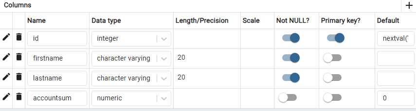

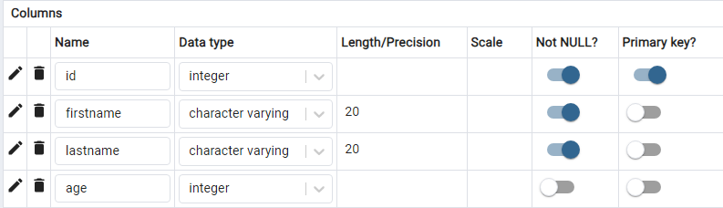


## Таблицы

В реляционных СУБД данные представляются в виде таблиц. 

Структура таблицы определяется ее столбцами. 

Собственно данные располагаются в строках; они хранятся неупорядоченными и даже не обязательно располагаются в порядке их добавления в таблицу.

Для каждого столбца устанавливается тип данных; значения полей в строках должны соответствовать этим типам.

PostgreSQL располагает большим числом встроенных типов ([datatype](https://postgrespro.ru/docs/postgrespro/16/datatype)) и возможностями для создания новых, но мы ограничимся самыми основными:

* integer — целые числа;
* text — текстовые строки;
* boolean — логический тип, принимающий значения `true` («истинно») или `false` («ложно»).

Помимо обычных значений, определяемых типом данных,поле может иметь неопределенное значение NULL — его можно рассматривать как «значение неизвестно» или «значение не задано».

## Создание и удаление таблиц

```sql
CREATE TABLE customers
(
    Id SERIAL PRIMARY KEY,
    FirstName CHARACTER VARYING(30),
    LastName CHARACTER VARYING(30),
    Email CHARACTER VARYING(30),
    Age INTEGER
);

```

В данном случае в таблице Customers определяются пять столбцов:

* Id, 
* FirstName, 
* LastName, 
* Age, 
* Email. 

Первый столбец - `Id` представляет идентификатор клиента, он служит первичным ключом и поэтому имеет тип `SERIAL`.

Фактически данный столбец будет хранить числовое значение `1, 2, 3` и т.д., которое для каждой новой строки будет автоматически увеличиваться на единицу.

Следующие три столбца представляют имя, фамилию клиента и его электронный адрес и имеют тип `CHARACTER VARYING(30)`, то есть представляют строку длиной не более `30 символов`.

Последний столбец - `Age` представляет возраст пользователя и имеет тип `INTEGER`, то есть хранит числа.

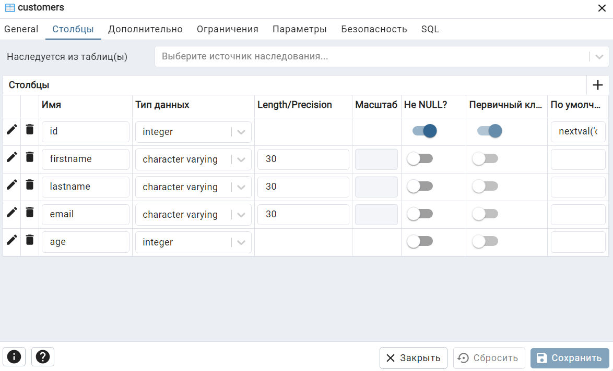

# Удаление таблиц

```sql
DROP TABLE customers;
```

# Ограничения столбцов и таблиц


При определении таблиц и их столбцов в SQL мы можем использовать ряд атрибутов, которые накладывают определенные ограничения. Рассмотрим эти атрибуты.

## PRIMARY KEY

С помощью выражения PRIMARY KEY столбец можно сделать первичным ключом.

```sql
CREATE TABLE Customers
(
    Id SERIAL PRIMARY KEY,
    FirstName CHARACTER VARYING(30),
    LastName CHARACTER VARYING(30),
    Email CHARACTER VARYING(30),
    Age INTEGER
)
```

Первичный ключ уникально идентифицирует строку в таблице. 


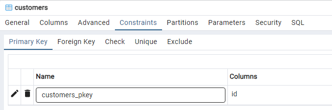

В качестве первичного ключа необязательно должны выступать столбцы с типом `SERIAL`, они могут представлять любой другой тип.

Установка первичного ключа на уровне таблицы:


```sql
CREATE TABLE Customers
(
    Id SERIAL,
    FirstName CHARACTER VARYING(30),
    LastName CHARACTER VARYING(30),
    Email CHARACTER VARYING(30),
    Age INTEGER,
    PRIMARY KEY(Id)
);
```


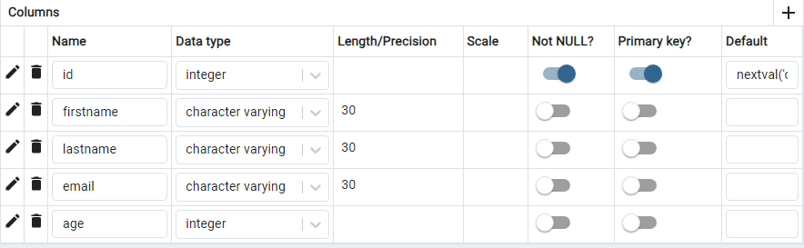

Первичный ключ может быть составным `compound key`. 

Такой ключ может потребоваться, если у нас сразу два столбца должны уникально идентифицировать строку в таблице. 

Например:

```sql
CREATE TABLE OrderLines
(
    OrderId INTEGER,
    ProductId INTEGER,
    Quantity INTEGER,
    Price MONEY,
    PRIMARY KEY(OrderId, ProductId)
);
```
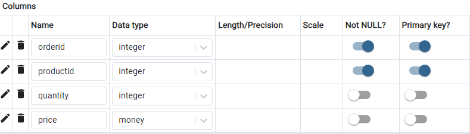

Здесь поля `OrderId` и `ProductId` вместе выступают как составной первичный ключ. 

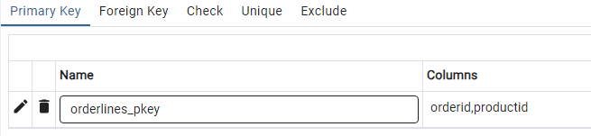

То есть в таблице `OrderLines` не может быть двух строк, где для обоих из этих полей одновременно были бы одни и те же значения.

## UNIQUE

Если мы хотим, чтобы столбец имел только уникальные значения, то для него можно определить атрибут `UNIQUE`.

```sql
CREATE TABLE Customers
(
    Id SERIAL PRIMARY KEY,
    FirstName CHARACTER VARYING(20),
    LastName CHARACTER VARYING(20),
    Email CHARACTER VARYING(30) UNIQUE,
    Phone CHARACTER VARYING(30) UNIQUE,
    Age INTEGER
);
```

В данном случае столбцы, которые представляют электронный адрес и телефон, будут иметь уникальные значения. 
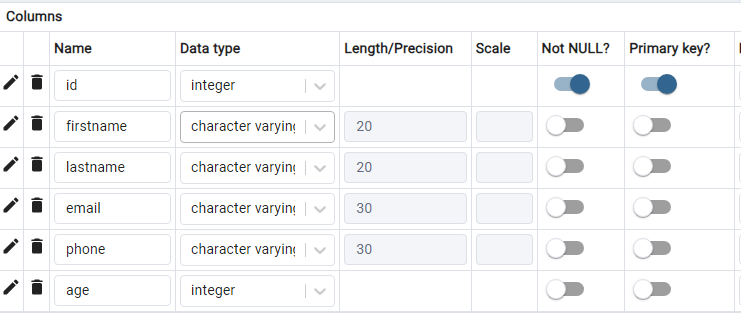


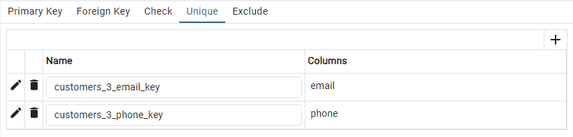

И мы не сможем добавить в таблицу две строки, у которых значения для этих столбцов будет совпадать.

Также мы можем определить этот атрибут на уровне таблицы:

```sql
CREATE TABLE Customers
(
    Id SERIAL PRIMARY KEY,
    FirstName CHARACTER VARYING(20),
    LastName CHARACTER VARYING(20),
    Email CHARACTER VARYING(30),
    Phone CHARACTER VARYING(30),
    Age INTEGER,
    UNIQUE(Email, Phone)
);
```

Или так:

```sql
CREATE TABLE Customers
(
    Id SERIAL PRIMARY KEY,
    FirstName CHARACTER VARYING(20),
    LastName CHARACTER VARYING(20),
    Email CHARACTER VARYING(30),
    Phone CHARACTER VARYING(30),
    Age INTEGER,
    UNIQUE(Email), 
    UNIQUE(Phone)
);
```

## NULL и NOT NULL

Чтобы указать, может ли столбец принимать значение `NULL`, при определении столбца ему можно задать атрибут `NULL` или `NOT NULL`. 

Если этот атрибут явным образом не будет использован, то по умолчанию столбец будет допускать значение `NULL`. 

Исключением является тот случай, когда столбец выступает в роли первичного ключа - в этом случае по умолчанию столбец имеет значение `NOT NULL`.


```sql
CREATE TABLE Customers
(
    Id SERIAL PRIMARY KEY,
    FirstName CHARACTER VARYING(20) NOT NULL,
    LastName CHARACTER VARYING(20) NOT NULL,
    Age INTEGER
);

```


## DEFAULT

Атрибут `DEFAULT` определяет значение по умолчанию для столбца. 

Если при добавлении данных для столбца не будет предусмотрено значение, то для него будет использоваться значение по умолчанию.

```sql
CREATE TABLE Customers
(
    Id SERIAL PRIMARY KEY,
    FirstName CHARACTER VARYING(20),
    LastName CHARACTER VARYING(20),
    Age INTEGER DEFAULT 18
);
```

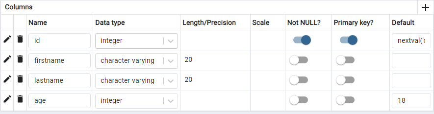

Здесь для столбца `Age` предусмотрено значение по умолчанию `18`.

## CHECK

Ключевое слово `CHECK` задает ограничение для диапазона значений, которые могут храниться в столбце.

Для этого после слова `CHECK` указывается в скобках условие, которому должен соответствовать столбец или несколько столбцов. 

Например, возраст клиентов не может быть меньше `0` или больше `100`:

```sql
CREATE TABLE Customers
(
    Id SERIAL PRIMARY KEY,
    FirstName CHARACTER VARYING(20),
    LastName CHARACTER VARYING(20),
    Age INTEGER DEFAULT 18 CHECK(Age >0 AND Age < 100),
    Email CHARACTER VARYING(30) UNIQUE CHECK(Email !=''),
    Phone CHARACTER VARYING(20) UNIQUE CHECK(Phone !='')
);
```
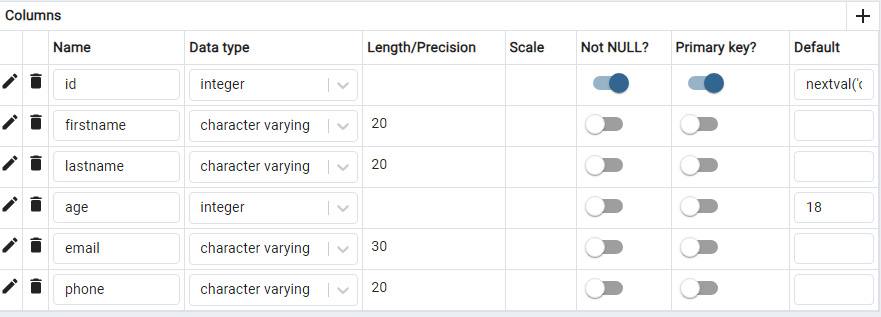


Здесь также указывается, что столбцы `Email` и `Phone` не могут иметь пустую строку в качестве значения (пустая строка не эквивалентна значению `NULL`).

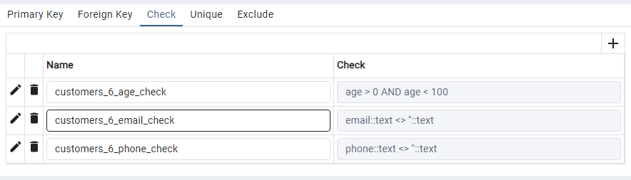

Для соединения условий используется ключевое слово `AND`. 

Условия можно задать в виде операций сравнения больше `(>)`, меньше `(<)`, не равно `(!=)`.

Также с помощью `CHECK` можно создать ограничение в целом для таблицы:

```sql
CREATE TABLE Customers
(
    Id SERIAL PRIMARY KEY,
    Age INTEGER DEFAULT 18,
    FirstName CHARACTER VARYING(20),
    LastName CHARACTER VARYING(20),
    Email CHARACTER VARYING(30) UNIQUE,
    Phone CHARACTER VARYING(20) UNIQUE,
    CHECK((Age >0 AND Age<100) AND (Email !='') AND (Phone !=''))
);
```

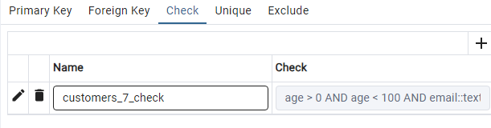
```sql
age > 0 AND age < 100 AND email::text <> ''::text AND phone::text <> ''::text
```

## Оператор CONSTRAINT. Установка имени ограничений.


С помощью ключевого слова `CONSTRAINT` можно задать имя для ограничений. 

В качестве ограничений могут использоваться `PRIMARY KEY, UNIQUE, CHECK`.

Имена ограничений можно задать на уровне столбцов. 

Они указываются после `CONSTRAINT` перед атрибутами:

```sql
CREATE TABLE Customers
(
    Id SERIAL CONSTRAINT customer_Id PRIMARY KEY,
    Age INTEGER CONSTRAINT customers_age_check CHECK(Age >0 AND Age < 100),
    FirstName CHARACTER VARYING(20) NOT NULL,
    LastName CHARACTER VARYING(20) NOT NULL,
    Email CHARACTER VARYING(30) CONSTRAINT customers_email_key UNIQUE,
    Phone CHARACTER VARYING(20) CONSTRAINT customers_phone_key UNIQUE
);
```

В принципе необязательно задавать имена ограничений, при установке соответствующих атрибутов SQL Server автоматически определяет их имена. 

Но, зная имя ограничения, мы можем к нему обращаться, например, для его удаления.

И также можно задать все имена ограничений через атрибуты таблицы:

```sql
CREATE TABLE Customers
(
    Id SERIAL,
    Age INTEGER,
    FirstName CHARACTER VARYING(20) NOT NULL,
    LastName CHARACTER VARYING(20) NOT NULL,
    Email CHARACTER VARYING(30),
    Phone CHARACTER VARYING(20),
    CONSTRAINT customer_Id PRIMARY KEY(Id),
    CONSTRAINT customers_age_check CHECK(Age >0 AND Age < 100),
    CONSTRAINT customers_email_key UNIQUE(Email),
    CONSTRAINT customers_phone_key UNIQUE(Phone)
);
```

Вне зависимости от того, используется оператор `CONSTRAINT` для создания ограничений или нет (в этом случае при установке ограничений `PostgreSQL` сам дает им имена), мы можем просмотреть все ограничения в `pgAdmin` в узле базы данных в подузле :


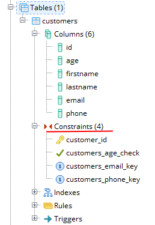

## Внешние ключи

Для связи между таблицами применяются внешние ключи. 

Внешний ключ устанавливается для столбца из зависимой, подчиненной таблицы `(referencing table)`, и указывает на один из столбцов из главной таблицы `(referenced table)`. 

Как правило, внешний ключ указывает на первичный ключ из связанной главной таблицы.

Общий синтаксис установки внешнего ключа на уровне столбца:

```sql
REFERENCES главная_таблица (столбец_главной_таблицы)
    [ON DELETE {CASCADE|RESTRICT}]
    [ON UPDATE {CASCADE|RESTRICT}]
```

Чтобы установить связь между таблицами, после ключевого слова `REFERENCES` указывается имя связанной таблицы и далее в скобках имя столбца из этой таблицы, на который будет указывать внешний ключ. 

После выражения `REFERENCES` может идти выражение `ON DELETE` и `ON UPDATE`, которые уточняют поведение при удалении или обновлении данных.

Общий синтаксис установки внешнего ключа на уровне таблицы:

```sql
FOREIGN KEY (стобец1, столбец2, ... столбецN) 
    REFERENCES главная_таблица (столбец_главной_таблицы1, столбец_главной_таблицы2, ... столбец_главной_таблицыN)
    [ON DELETE {CASCADE|RESTRICT}]
    [ON UPDATE {CASCADE|RESTRICT}]
```


Например, определим две таблицы и свяжем их посредством внешнего ключа:

```sql
CREATE TABLE Customers
(
    Id SERIAL PRIMARY KEY,
    Age INTEGER, 
    FirstName VARCHAR(20) NOT NULL
);
  
CREATE TABLE Orders
(
    Id SERIAL PRIMARY KEY,
    CustomerId INTEGER REFERENCES Customers (Id),
    Quantity INTEGER
);

```


Здесь определены таблицы `Customers и Orders`. 

`Customers` является главной и представляет клиента. 

`Orders` является зависимой и представляет заказ, сделанный клиентом.

Эта таблица через столбец `CustomerId` связана с таблицей `Customers` и ее столбцом `Id`. 

То есть столбец `CustomerId` является внешним ключом, который указывает на столбец `Id` из таблицы `Customers`.

Определение внешнего ключа на уровне таблицы выглядело бы следующим образом:

```sql
CREATE TABLE Customers
(
    Id SERIAL PRIMARY KEY,
    Age INTEGER, 
    FirstName VARCHAR(20) NOT NULL
);
  
CREATE TABLE Orders
(
    Id SERIAL PRIMARY KEY,
    CustomerId INTEGER,
    Quantity INTEGER,
    FOREIGN KEY (CustomerId) REFERENCES Customers (Id)
);
```

## ON DELETE и ON UPDATE

С помощью выражений `ON DELETE` и `ON UPDATE` можно установить действия, которые выполняются соответственно при удалении и изменении связанной строки из главной таблицы.

Для установки подобного действия можно использовать следующие опции:

* CASCADE: автоматически удаляет или изменяет строки из зависимой таблицы при удалении или изменении связанных строк в главной таблице.

* RESTRICT: предотвращает какие-либо действия в зависимой таблице при удалении или изменении связанных строк в главной таблице. То есть фактически какие-либо действия отсутствуют.

* NO ACTION: действие по умолчанию, предотвращает какие-либо действия в зависимой таблице при удалении или изменении связанных строк в главной таблице. И генерирует ошибку. В отличие от RESTRICT выполняет отложенную проверку на связанность между таблицами.

* SET NULL: при удалении связанной строки из главной таблицы устанавливает для столбца внешнего ключа значение NULL.

* SET DEFAULT: при удалении связанной строки из главной таблицы устанавливает для столбца внешнего ключа значение по умолчанию, которое задается с помощью атрибуты DEFAULT. Если для столбца не задано значение по умолчанию, то в качестве него применяется значение NULL.

## Каскадное удаление

По умолчанию, если на строку из главной таблицы по внешнему ключу ссылается какая-либо строка из зависимой таблицы, то мы не сможем удалить эту строку из главной таблицы. 

Вначале нам необходимо будет удалить все связанные строки из зависимой таблицы. 

И если при удалении строки из главной таблицы необходимо, чтобы были удалены все связанные строки из зависимой таблицы, то применяется каскадное удаление, то есть опция `CASCADE`:

```sql
CREATE TABLE Orders
(
    Id SERIAL PRIMARY KEY,
    CustomerId INTEGER,
    Quantity INTEGER,
    FOREIGN KEY (CustomerId) REFERENCES Customers (Id) ON DELETE CASCADE
);
```

Аналогично работает выражение `ON UPDATE CASCADE`. 

При изменении значения первичного ключа автоматически изменится значение связанного с ним внешнего ключа. 

Но так как первичные ключи, как правило, изменяются очень редко, да и с принципе не рекомендуется использовать в качестве первичных ключей столбцы с изменяемыми значениями, то на практике выражение `ON UPDATE` используется редко.

## Установка NULL

При установки для внешнего ключа опции `SET NULL` необходимо, чтобы столбец внешнего ключа допускал значение `NULL`:

```sql
CREATE TABLE Orders
(
    Id SERIAL PRIMARY KEY,
    CustomerId INTEGER,
    Quantity INTEGER,
    FOREIGN KEY (CustomerId) REFERENCES Customers (Id) ON DELETE SET NULL
);
```

## Установка значения по умолчанию

```sql
CREATE TABLE Orders
(
    Id SERIAL PRIMARY KEY,
    CustomerId INTEGER DEFAULT 1,
    Quantity INTEGER,
    FOREIGN KEY (CustomerId) REFERENCES Customers (Id) ON DELETE SET DEFAULT
);
```
Если для столца значение по умолчанию не задано через параметр `DEFAULT`, то в качестве такового используется значение `NULL` (если столбец допускает `NULL)`.

## Изменение таблиц


Нередко возникает изменить уже имеющуюся таблицу, в частности, добавить или удалить столбцы, изменить тип столбцов и т.д.. То есть потребуется изменить определение таблицы. Для этого применяется выражение ALTER TABLE, которое имеет следующий формальный синтаксис:

```sql
ALTER TABLE название_таблицы
{ ADD название_столбца тип_данных_столбца [ограничения_столбца] | 
  DROP COLUMN название_столбца |
  ALTER COLUMN название_столбца параметры_столбца |
  ADD [CONSTRAINT] определение_ограничения |
  DROP [CONSTRAINT] имя_ограничения}
```

Рассмотрим некоторые возможности по изменению таблицы.

## Добавление нового столбца

Добавим в таблицу Customers новый столбец Phone:

```sql
ALTER TABLE Customers
ADD Phone CHARACTER VARYING(20) NULL;
```


Здесь столбец Phone имеет тип `CHARACTER VARYING(20`), и для него определен атрибут `NULL`, то есть столбец допускает отсутствие значения. 

Но что если нам надо добавить столбец, который не должен принимать значения `NULL`? 

Если в таблице есть данные, то следующая команда не будет выполнена:

```sql
ALTER TABLE Customers
ADD Address CHARACTER VARYING(30) NOT NULL;
```

Поэтому в данном случае решение состоит в установке значения по умолчанию через атрибут `DEFAULT`:

```sql
ALTER TABLE Customers
ADD Address CHARACTER VARYING(30) NOT NULL DEFAULT 'Неизвестно';
```


## Удаление столбца

Удалим столбец `Address` из таблицы `Customers`:

```sql
ALTER TABLE Customers
DROP COLUMN Address;
```

## Изменение типа столбца

Для изменения типа применяется ключевое слово `TYPE`.
Изменим в таблице `Customers` тип данных у столбца `FirstName` на `VARCHAR(50)` (он же `VARYING CHARACTER(50)`):

```sql
ALTER TABLE Customers
ALTER COLUMN FirstName TYPE VARCHAR(50);
```

## Изменение ограничений столбца

Для добавления ограничения применяется оператор `SET`, после которого указывается ограничение. 

Например, установим для столбца `FirstName` ограничение `NOT NULL`:

```sql
ALTER TABLE Customers 
ALTER COLUMN FirstName 
SET NOT NULL;
```

Для удаления ограничения применяется оператор `DROP`, после которого указывается ограничение. 
Например, удалим выше установленное ограничение:

```sql
ALTER TABLE Customers 
ALTER COLUMN FirstName 
DROP NOT NULL;
```

## Изменение ограничений таблицы

Добавление ограничения `CHECK`:


```sql
ALTER TABLE Customers
ADD CHECK (Age > 0);
```

Добавление первичного ключа PRIMARY KEY:

```sql
ALTER TABLE Customers 
ADD PRIMARY KEY (Id);
```


В данном случае предполагается, что в таблице уже есть столбец `Id`, который не имеет ограничения `PRIMARY KEY`. А с помощью вышеуказанного скрипта устанавливается ограничение `PRIMARY KEY`.

Добавление ограничение `UNIQUE` - определим для столбца `Email` уникальные значения:

```sql
ALTER TABLE Customers
ADD UNIQUE (Email);
```

При добавлении ограничения каждому из них дается определенное имя. 

Например, выше добавленное ограничение для `CHECK` будет называться `customers_age_check`. 

Имена ограничений можно посмотреть в таблице через `pgAdmin`.

Также мы можем явным образом назначить ограничению при добавлении имя с помощью оператора `CONSTRAINT`.

```sql
ALTER TABLE Customers
ADD CONSTRAINT phone_unique UNIQUE (Phone);
```

В данном случае ограничение будет называться `phone_unique`.

Чтобы удалить ограничение, надо знать его имя, которое указывается после выражения `DROP CONSTRAINT`. 

Например, удалим выше добавленное ограничение:

```sql
ALTER TABLE Customers
DROP CONSTRAINT phone_unique;
```

Переименование столбца и таблицы

Переименуем столбец `Address` в `City`:

```sql
ALTER TABLE Customers
RENAME COLUMN Address TO City;
```
Переименуем таблицу `Customers` в `Users`:

```sql
ALTER TABLE Customers
RENAME TO Users;
```