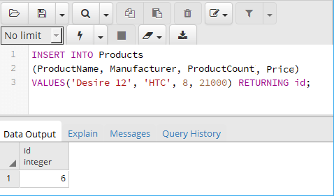

# Добавление данных. Команда Insert


```
CREATE TABLE Products
(
    Id SERIAL PRIMARY KEY,
    ProductName VARCHAR(30) NOT NULL,
    Manufacturer VARCHAR(20) NOT NULL,
    ProductCount INTEGER DEFAULT 0,
    Price NUMERIC
);

```


```sql
INSERT INTO Products VALUES (1, 'Galaxy S9', 'Samsung', 4, 63000)

```

Стоит учитывать, что значения для столбцов в скобках после ключевого слова `VALUES` передаются по порядку их объявления. 

Например, в выражении `CREATE TABLE` выше можно увидеть, что первым столбцом идет `Id`, поэтому этому столбцу передается число 1. 

Второй столбец называется `ProductName`, поэтому второе значение - строка `"Galaxy S9"` будет передано именно этому столбцу и так далее. 

То есть значения передаются столбцам следующим образом:

* Id: 1

* ProductName: 'Galaxy S9'

* Manufacturer: 'Samsung'

* ProductCount: 4

* Price: 63000

Также при вводе значений можно указать непосредственные столбцы, в которые будут добавляться значения:

```sql
INSERT INTO Products (ProductName, Price, Manufacturer) 
VALUES ('iPhone X', 71000, 'Apple');

```


Здесь значение указывается только для трех столбцов. 

Причем теперь значения передаются в порядке следования столбцов:

* ProductName: 'iPhone X'

* Manufacturer: 'Apple'

* Price: 71000

Для столбца `Id` значение будет генерироваться автоматически базой данных, так как он представляет тип `Serial`. 

То есть к значению из последней строки будет добавляться единица.

Для остальных столбцов будет добавляться значение по умолчанию, если задан атрибут `DEFAULT` (например, для столбца `ProductCount`), значение `NULL`. 

При этом неуказанные столбцы (за исключением тех, которые имеют тип `Serial`) должны допускать значение `NULL` или иметь атрибут `DEFAULT`.

Если конкретные столбцы не указываются, как в первом примере, тогда мы должны передать значения для всех столбцов в таблице.

Также мы можем добавить сразу несколько строк:

```sql
INSERT INTO Products  (ProductName, Manufacturer, ProductCount, Price)
VALUES
('iPhone 6', 'Apple', 3, 36000),
('Galaxy S8', 'Samsung', 2, 46000),
('Galaxy S8 Plus', 'Samsung', 1, 56000)

```

В данном случае в таблицу будут добавлены три строки.

## Возвращение значений

Если мы добавляем значения только для части столбцов, то мы можем не знать, какие значения будут у других столбцов. 

Например, какое значени получит столбец `Id` у товара. 

С помощью оператора `RETURNING` мы можем получить это значение:

```sql
INSERT INTO Products 
(ProductName, Manufacturer, ProductCount, Price) 
VALUES('Desire 12', 'HTC', 8, 21000) RETURNING id;
```

