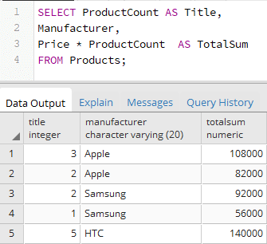

# Получение данных. Команда Select


Например, пусть ранее была создана таблица `Products`, и в нее добавлены некоторые начальные данные:

```sql

CREATE TABLE Products
(
    Id SERIAL PRIMARY KEY,
    ProductName VARCHAR(30) NOT NULL,
    Manufacturer VARCHAR(20) NOT NULL,
    ProductCount INTEGER DEFAULT 0,
    Price NUMERIC
);
 
INSERT INTO Products (ProductName, Manufacturer, ProductCount, Price)
VALUES
('iPhone X', 'Apple', 3, 36000),
('iPhone 8', 'Apple', 2, 41000),
('Galaxy S9', 'Samsung', 2, 46000),
('Galaxy S8 Plus', 'Samsung', 1, 56000),
('Desire 12', 'HTC', 5, 28000);

```

```sql
SELECT * FROM Products;

```

Однако использование символа звездочки `*` считается не очень хорошей практикой, так как, как правило, не все столбцы бывают нужны. 

И более оптимальный подход заключается в указании всех необходимых столбцов после слова `SELECT`. 

```sql
SELECT ProductName, Price FROM Products;
```

Спецификация столбца необязательно должна представлять его название. Это может быть любое выражение, например, результат арифметической операции. Так, выполним следующий запрос:


Здесь при выборке будут создаваться три столбца. 

Причем третий столбец представляет значение столбца `Price`, умноженное на значение столбца `ProductCount`, то есть совокупную стоимость товара.

С помощью оператора AS можно изменить название выходного столбца или определить его псевдоним:
```sql
SELECT ProductCount, Manufacturer, Price * ProductCount
FROM Products;


SELECT ProductCount AS Title, 
Manufacturer, 
Price * ProductCount  AS TotalSum
FROM Products;

```

В данном случае результатом выборки являются данные по 3-м столбцам. 

Для первого столбца определяется псевдоним `Title`, хотя в реальности он будет представлять столбец `ProductName`.

Второй столбец сохраняет свое название - `Manufacturer`. Третий столбец `TotalSum` хранит произведение столбцов `ProductCount` и `Price`.


