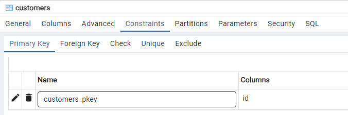
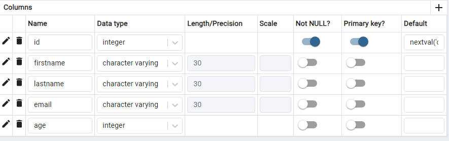

## База данных

Создадим новую базу данных с именем `test`.

Выполните:

```sql
postgres=# CREATE DATABASE test;
CREATE DATABASE
```

Не забудьте про точку с запятой в конце команды — пока `PostgreSQL` не увидит этот символ, он будет считать, что вы
продолжаете ввод (то есть команда может быть разбита на несколько строк).

Теперь переключимся на созданную базу:

```sql
postgres=# \c test
```

```sql
You are now connected to database "test" as user

"postgres".
test=#
```

Как видите, приглашение сменилось на `test=#`.


Команда, которую мы только что ввели, не похожа на `SQL` — она начинается с обратной косой черты. 

Так выглядят специальные команды, которые понимает только `psql` (поэтому, если у вас открыт `pgAdmin`# или другое графическое
средство, пропускайте все, что начинается с косой черты, или поищите замену).


Команд `psql` довольно много; с некоторыми из них мы познакомимся чуть позже, а полный список с краткими описаниями можно получить :

```sql
test=# \?
```

Создать бд можно с помощью графического интерфейса


## Таблицы
В реляционных СУБД данные представляются в виде таблиц. 

Структура таблицы определяется ее столбцами. 

Собственно данные располагаются в строках; они хранятся неупорядоченными и даже не обязательно располагаются в порядке их добавления в таблицу.

Для каждого столбца устанавливается тип данных; значения полей в строках должны соответствовать этим типам.

PostgreSQL располагает большим числом встроенных типов ([datatype](https://postgrespro.ru/docs/postgrespro/16/datatype)) и возможностями для создания новых, но мы ограничимся самыми основными:

* integer — целые числа;
* text — текстовые строки;
* boolean — логический тип, принимающий значения `true` («истинно») или `false` («ложно»).

Помимо обычных значений, определяемых типом данных,поле может иметь неопределенное значение NULL — его можно рассматривать как «значение неизвестно» или «значение не задано».


Давайте создадим таблицу дисциплин, читаемых в вузе

```sql
test=# CREATE TABLE courses(
test(# c_no text PRIMARY KEY,
test(# title text,
test(# hours integer
test(# );
CREATE TABLE
```


```sql
CREATE TABLE courses (
	c_no text PRIMARY KEY,
	title text,
	hours integer
	);

```





мы определили, что таблица с именем courses будет состоять из трех столбцов: 

* c_no — текстовый номер курса, 
* title — название курса, 
* hours — целое число лекционных часов.


Кроме столбцов и типов данных, можно ввести ограничения целостности, которые будут проверяться автоматически, — `СУБД` не допустит появления в базе некорректных данных. 

В нашем примере добавлено ограничение `PRIMARY KEY` для столбца `c_no`; теперь в нем не допускаются повторяющиеся, а также неопределенные значения.

С помощью такого столбца можно отличать строки другот друга. 

Полный список ограничений целостности есть на странице postgrespro.ru/doc/ddl-constraints.

Точный синтаксис команды `CREATE TABLE` можно посмотреть в документации, а можно прямо в psql:

```sql
test=# \help CREATE TABLE
```

Такая справка есть по каждой команде SQL, а полный список команд покажет `\help` без параметров.

Создание таблицы средствами `GUI`




## Удаление таблиц

Для удаления таблиц используется команда `DROP TABLE`, которая имеет следующий синтаксис:

```sql
DROP TABLE table1 [, table2, ...];
DROP TABLE courses-2;
DROP TABLE IF EXISTS courses-2;
```


