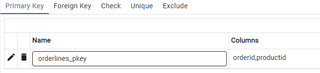

## Наполнение таблиц

Добавим в созданную таблицу несколько строк:

```sql
INSERT INTO courses(c_no, title, hours)
    VALUES ('CS301', 'Базы данных', 30),
    ('CS305', 'Сети ЭВМ', 60);

```



Для массовой загрузки данных из внешнего источника команда INSERT подходит плохо, зато есть специально предназначенная для этого команда COPY: [COPY](postgrespro.ru/doc/sql-copy)


## Наполнение таблицы из csv-файла
`students.csv`

```csv
s_id,name,start_year
1451,Иван,2024
1432,Олег,2024
1556,Ольга,2025
```


* windows
```sh
copy students_1 from 'C:\Users\Public\students.csv' delimiter ',' encoding 'UTF-8' csv header;
```

* linux

```sh
\copy students from '/home/student/Documents/students.csv' delimiter ',' encoding 'utf-8' csv header;
\copy students to '/home/student/Documents/students-1.csv' delimiter ',' encoding 'utf-8' csv header;

```


Обратное копирование в csv-файл

``` sh
copy students_1 to 'C:\Users\Public\students-1.csv' delimiter ',' encoding 'UTF-8' csv header
```
* linux

```sh
\copy students to '/home/student/Documents/students-1.csv' delimiter ',' encoding 'utf-8' csv header;

```


Добавление из csv-файла
`students-2.csv`

```csv
s_id,name,start_year
1461, Игорь,2024
1462,Егор,2024
1566,Юлия,2025
```


```sh
copy students_1 from 'C:\Users\Public\students-2.csv' delimiter ',' encoding 'UTF-8' csv header;
```


## Создание и наполнение таблиц из текстовых файлов и входящего потока stdin 


```sql
CREATE TABLE table_colors (
    id integer NOT NULL,
    code text
);

COPY table_colors (id, code) FROM 'C:\Users\Public\colors.txt' ;
\copy table_colors (id, code) from '/home/student/Documents/colors.txt';

```

```txt
1	красный
2	зеленый
3	синий
4	белый
```

## stdin (в psql-терминале) 

```sql
COPY table_colors (id, code) FROM stdin;
1	красный
2	зеленый
3	синий
4	белый
5	\N
6	\N
\.
```


## Excel

[https://www.postgresql.org/ftp/odbc/releases/](https://www.postgresql.org/ftp/odbc/releases/)


## Связанные таблицы

Создадим в базе еще две таблицы: `«Студенты»` и `«Экзамены»`. 

Пусть по каждому студенту хранится его имя и год поступления, а идентифицироваться он будет номером студенческого билета.

```sql
CREATE TABLE students(
    s_id integer PRIMARY KEY,
    name text,
    start_year integer
);


test=# INSERT INTO students(s_id, name, start_year)
VALUES (1451, 'Анна', 2024),
        (1432, 'Виктор', 2024),
        (1556, 'Нина', 2025);
```

Таблица экзаменов содержит данные об оценках, полученных студентами по различным дисциплинам. 
Таким образом, студенты и дисциплины связаны друг с другом отношением `«многие ко многим»`: один студент может сдавать

```sql
CREATE TABLE exams(
        s_id integer REFERENCES students(s_id),
        c_no text REFERENCES courses(c_no),
        score integer,
        CONSTRAINT pk PRIMARY KEY(s_id, c_no)
);
```

Кроме того, с помощью предложения REFERENCES мы добавили два ограничения ссылочной целостности, называемые внешними ключами. 

Такие ограничения показывают, что значения в одной таблице ссылаются на строки в другой таблице.

Теперь при любых действиях СУБД будет проверять соответствие всех идентификаторов s_id, указанных в таблице экзаменов, реальным студентам (то есть записям в таблице студентов), а также номера c_no — реальным курсам.

Таким образом, будет исключена возможность поставить оценку несуществующему студенту или же по несуществующей дисциплине — независимо от действий пользователя или возможных ошибок в приложении.


Поставим нашим студентам несколько оценок:

```sql 
    INSERT INTO exams(s_id, c_no, score)
    VALUES (1451, 'CS301', 5),
    (1556, 'CS301', 5),
    (1451, 'CS305', 5),
    (1432, 'CS305', 4);
```


## Дополнительно

Кириллица в psql
```sh
\! chcp 1251
```