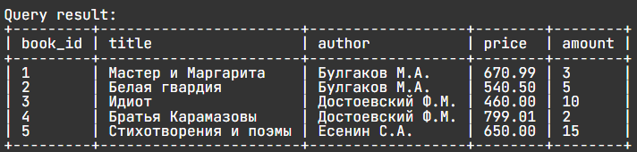
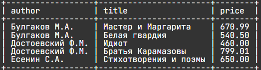
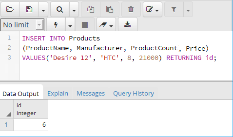
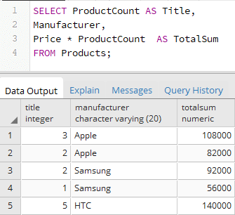
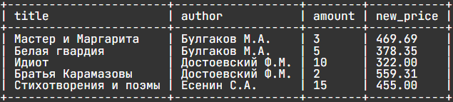
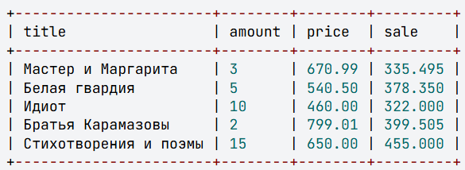
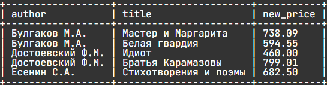

# Практика 

## 1. Сформулируйте `SQL` запрос для создания таблицы `book`. 

Структура таблицы book:

|   Поле  | Тип, описание | 
| ------- | ------------- | 
| book_id | integer, primary key| 
| title   | character varying(50)| 
| author  | character varying(30) | 
| price   | numeric (8,2) | 
| amount  | integer | 

## 2. Добавьте записи в таблицу из csv-файла 

```csv
book_id,title,author,price,amount 
1,Мастер и Маргарита ,Булгаков М.А.,670.99,3
2,Белая гвардия,Булгаков М.А. ,540.5,5
3,Идиот,Достоевский Ф.М.,460,10
```


## 3. Добавьте 3 записи в таблицу с помощью SQL

```  
Братья Карамазовы Достоевский Ф.М.  799.01 , 2      
Стихотворения и поэмы Есенин С.А. 650.00  15     
```


## 4. Вывести информацию о всех книгах



## 5. Выбрать авторов, название книг и их цену из таблицы book



## 6. Выбрать названия книг и авторов из таблицы book, для поля title задать имя(псевдоним) Название, для поля author –  Автор. 



## 7. Вывести всю информацию о книгах, а также для каждой позиции посчитать ее стоимость (произведение цены на количество). Вычисляемому столбцу дать имя total .

Запрос:

```sql
SELECT title, author, price, amount, 
     price * amount AS total 
FROM book;
```

## 8. Для упаковки каждой книги требуется один лист бумаги, цена которого 1 рубль 65 копеек. 
Посчитать стоимость упаковки для каждой книги (сколько денег потребуется, чтобы упаковать все экземпляры книги). В запросе вывести название книги, ее количество и стоимость упаковки, последний столбец назвать pack. 



## 9. Для каждой книги из таблицы book вычислим налог на добавленную стоимость (имя столбца tax) , который включен в цену и составляет k = 18%,  а также цену книги (price_tax) без него. 

```sql
SELECT title, price, 
    (price*18/100)/(1+18/100) AS tax, 
    price/(1+18/100) AS price_tax 
FROM book;
```

Сумма налога и цена книги без налога – это деньги, поэтому количество знаков после запятой у этих чисел должно быть 2. Следовательно необходимо округлить полученные значения.

```sql
SELECT title, 
    price, 
    ROUND((price*18/100)/(1+18/100),2) AS tax, 
    ROUND(price/(1+18/100),2) AS price_tax 
FROM book;
```

## 10. В конце года цену каждой книги на складе пересчитывают – снижают ее на 30%. 
Написать SQL запрос, который из таблицы book выбирает названия, авторов, количества и вычисляет новые цены книг. Столбец с новой ценой назвать new_price, цену округлить до 2-х знаков после запятой.




## 11. Для каждой книги из таблицы book установим скидку следующим образом: если количество книг меньше 4, то скидка будет составлять 50% от цены, в противном случае 30%.

```sql
SELECT title, amount, price, 
    IF(amount<4, price*0.5, price*0.7) AS sale
FROM book;
```




## 12. При анализе продаж книг выяснилось, что наибольшей популярностью пользуются книги Михаила Булгакова, на втором месте книги Сергея Есенина. 
Исходя из этого решили поднять цену книг Булгакова на 10%, а цену книг Есенина - на 5%. Написать запрос, куда включить автора, название книги и новую цену, последний столбец назвать new_price. Значение округлить до двух знаков после запятой.

