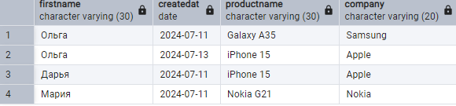
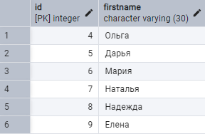
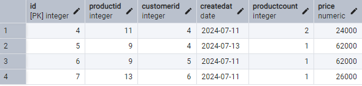
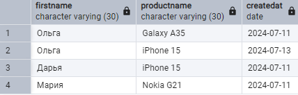
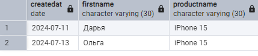

# Соединение таблиц
## Неявное соединение таблиц


Нередко возникает ситуация, когда нам надо получить данные из нескольких таблиц. 

Для соединения данных из разных таблиц можно использовать команду `SELECT`. 

### Создайте следующие три таблицы, которые связаны между собой связями:

```sql
CREATE TABLE Products
(
    Id SERIAL PRIMARY KEY,
    ProductName VARCHAR(30) NOT NULL,
    Company VARCHAR(20) NOT NULL,
    ProductCount INTEGER DEFAULT 0,
    Price NUMERIC NOT NULL
);
CREATE TABLE Customers
(
    Id SERIAL PRIMARY KEY,
    FirstName VARCHAR(30) NOT NULL
);
CREATE TABLE Orders
(
    Id SERIAL PRIMARY KEY,
    ProductId INTEGER REFERENCES Products(Id) ON DELETE SET NULL,
    CustomerId INTEGER REFERENCES Customers(Id) ON DELETE SET NULL,
    CreatedAt DATE NOT NULL,
    ProductCount INTEGER DEFAULT 1,
    Price NUMERIC NOT NULL
);
```


В данном случае таблицы `Customers` и `Products` связаны с таблицей `Orders` связью один ко многим. 

Таблица `Orders` в виде внешних ключей `ProductId` и `CustomerId` содержит ссылки на столбцы `Id` из соответственно таблиц `Products` и `Customers`. 

Также она хранит количество купленного товара `ProductCount` и и по какой цене он был куплен `Price`. 

И кроме того, таблицы также хранит в виде столбца `CreatedAt` дату покупки.




<a name="source_tables">
Заполните таблицы данными:
</a>


```sql
INSERT INTO Products(ProductName, Company, ProductCount, Price) 
VALUES 
    ('iPhone X', 'Apple', 2, 66000),
    ('iPhone 15', 'Apple', 2, 62000),
    ('iPhone 16 Pro', 'Apple', 5, 12000),
    ('Galaxy A35', 'Samsung', 2, 24000),
    ('Galaxy M15', 'Samsung', 1, 18000),
    ('Nokia G21', 'Nokia', 2, 26000),
    ('HTC U24', 'HTC', 6, 38000);
  
INSERT INTO Customers(FirstName) 
VALUES 
    ('Ольга'), 
    ('Дарья'),
    ('Мария'),
    ('Наталья'),
    ('Надежда'),
    ('Елена');
  
INSERT INTO Orders(ProductId, CustomerId, CreatedAt, ProductCount, Price) 
VALUES
( 
    (SELECT Id FROM Products WHERE ProductName='Galaxy A35'), 
    (SELECT Id FROM Customers WHERE FirstName='Ольга'),
    '2024-07-11',  
    2, 
    (SELECT Price FROM Products WHERE ProductName='Galaxy A35')
),
( 
    (SELECT Id FROM Products WHERE ProductName='iPhone 15'), 
    (SELECT Id FROM Customers WHERE FirstName='Ольга'),
    '2024-07-13',  
    1, 
    (SELECT Price FROM Products WHERE ProductName='iPhone 15')
),
( 
    (SELECT Id FROM Products WHERE ProductName='iPhone 15'), 
    (SELECT Id FROM Customers WHERE FirstName='Дарья'),
    '2024-07-11',  
    1, 
    (SELECT Price FROM Products WHERE ProductName='iPhone 15')
),
( 
    (SELECT Id FROM Products WHERE ProductName='Nokia G21'), 
    (SELECT Id FROM Customers WHERE FirstName='Мария'),
    '2024-07-11',  
    1, 
    (SELECT Price FROM Products WHERE ProductName='Nokia G21')
);

```






### Задание 1. Соедините две таблицы `Orders` и `Customers` с помощью команды 'SELECT':

```sql
SELECT * FROM Orders, Customers;
```

При такой выборке для каждая строка из таблицы `Orders` будет совмещаться с каждой строкой из таблицы `Customers`. 

То есть, получится перекрестное соединение. 

#### Почему получилось 24 строки?

Например, в `Orders` ... строки, а в `Customers` ... строки, значит мы получим `o * c = 24 строки`:


То есть в данном случае мы получаем прямое (декартово) произведение двух групп. 

#### А сколько строк получится в результате такого запроса:
```sql
SELECT * FROM Orders, Products;
```

Однако вряд ли такой результат можно назвать желаемым. 


Тем более каждый заказ из `Orders` связан с конкретным покупателем из `Customers`, а не со всеми возможными покупателями.

### Задание 2. Отфильтруйте строки для условия: 
поле `CustomerId` из `Orders` соответствует полю `Id` из `Customers`

Для решения этой задачи необходимо использовать выражение `WHERE`:

```sql
SELECT * FROM Orders, Customers
WHERE Orders.CustomerId = Customers.Id;
```


### Задание 3. Объедините данные по трем таблицам `Orders, Customers и Proucts`. 

То есть получите все заказы и добавьте информацию по клиенту и связанному товару:

```sql
SELECT Customers.FirstName, Products.ProductName, Orders.CreatedAt 
FROM Orders, Customers, Products
WHERE Orders.CustomerId = Customers.Id AND Orders.ProductId=Products.Id;
```



Так как здесь соединяются три таблицы, то необходимо применить как минимум два условия. 

Ключевой таблицей остается `Orders`, из которой извлекаются все заказы, а затем к ней подсоединяются данные по клиенту по условию `Orders.CustomerId = Customers.Id` и данные по товару по условию `Orders.ProductId=Products.Id`


### Задание 4. Используйте псевдонимы для сокращения кода

```sql
SELECT C.FirstName, P.ProductName, O.CreatedAt 
FROM Orders AS O, Customers AS C, Products AS P
WHERE O.CustomerId = C.Id AND O.ProductId=P.Id;
```

Если необходимо при использовании псевдонима выбрать все столбцы из определенной таблицы, то можно использовать звездочку:

```sql
SELECT C.FirstName, P.ProductName, O.*
FROM Orders AS O, Customers AS C, Products AS P
WHERE O.CustomerId = C.Id AND O.ProductId=P.Id;
```

# INNER JOIN

Еще одним способом соединения таблиц является использование оператора `JOIN` или `INNER JOIN`. 

Он представляет так называемое внутренее соединение. Его формальный синтаксис:

```sql
SELECT столбцы
FROM таблица1
    [INNER] JOIN таблица2
    ON условие1
    [[INNER] JOIN таблица3
    ON условие2]
```

После оператора `JOIN` идет название второй таблицы, данные которой надо добавить в выборку. 

Перед `JOIN` можно указывать необязательный оператор `INNER`. 

Его наличие или отсутствие ни на что не влияет. 

Далее после ключевого слова `ON` указывается условие соединения. 

Это условие устанавливает, как две таблицы будут сравниваться. 

Как правило, для соединения применяется первичный ключ главной таблицы и внешний ключ зависимой таблицы.

Возьмем [предыдущие таблицы с данными](#source_tables):

### Задание 5. Используя `JOIN`, выберите все заказы и добавьте к ним информацию о товарах:

```sql
SELECT Orders.CreatedAt, Orders.ProductCount, Products.ProductName 
FROM Orders
JOIN Products ON Products.Id = Orders.ProductId;
```

Поскольку таблицы могут содержать столбцы с одинаковыми названиями, то при указании столбцов для выборки указывается их полное имя вместе с именем таблицы, например, `Orders.ProductCount`.


### Задание 6. С помощью псевдонимов сократите код:


```sql
SELECT O.CreatedAt, O.ProductCount, P.ProductName 
    FROM Orders AS O
    JOIN Products AS P
        ON P.Id = O.ProductId;
```

Подобным образом мы можем присоединять и другие таблицы. 

### Задание 7. Добавьте к заказу информацию о покупателе из таблицы `Customers`:

```sql
SELECT O.CreatedAt, C.FirstName, P.ProductName 
    FROM Orders as O
    JOIN Products  as P 
        ON P.Id = O.ProductId
    JOIN Customers as C 
        ON C.Id = O.CustomerId;
```


### Задание 8. Сделайте фильтрацию выборки по цене товара > 45 000 и отсортируйте её по FirstName:

```sql
SELECT Orders.CreatedAt, Customers.FirstName, Products.ProductName 
    FROM Orders
        JOIN Products 
            ON Products.Id = Orders.ProductId
        JOIN Customers 
            ON Customers.Id=Orders.CustomerId
        WHERE Products.Price > 45000
    ORDER BY Customers.FirstName;
```



Условия после ключевого слова `ON` могут быть более сложными по составу. 

### Задание 9. Выберете все заказы на товары, производителем которых является Samsung (2 способа).


```sql
SELECT Orders.CreatedAt, Customers.FirstName, Products.ProductName 
    FROM Orders
        JOIN Products 
            ON Products.Id = Orders.ProductId AND Products.Company='Apple'
        JOIN Customers
            ON Customers.Id=Orders.CustomerId
    ORDER BY Customers.FirstName;
```

```sql
SELECT O.CreatedAt, C.FirstName, P.ProductName 
    FROM Orders as O
        JOIN Products as P 
            ON P.Id = O.ProductId
        JOIN Customers as C 
            ON C.Id = O.CustomerId
        WHERE P.Company='Apple'
    ORDER BY C.FirstName;

```


# OUTER JOIN и CROSS JOIN

`OUTER JOIN` или внешнее соединение позволяет возвратить все строки одной или двух таблиц, которые участвуют в соединении.

`Outer Join` имеет следующий формальный синтаксис:

```sql
SELECT столбцы
FROM таблица1
    {LEFT|RIGHT|FULL} [OUTER] JOIN таблица2 ON условие1
    [{LEFT|RIGHT|FULL} [OUTER] JOIN таблица3 ON условие2]...
```

Перед оператором `JOIN` указывается одно из ключевых слов `LEFT`, `RIGHT` или `FULL`, которые определяют тип соединения:

* LEFT: выборка будет содержать все строки из первой или левой таблицы

* RIGHT: выборка будет содержать все строки из второй или правой таблицы

* FULL: выборка будет содержать все строки из обеих таблиц

Перед оператором `JOIN` может указываться ключевое слово `OUTER`, но его применение необязательно. 

После `JOIN` указывается присоединяемая таблица, а затем идет условие соединения после оператора `ON`.

К примеру, снова возьмем [предыдущие таблицы с данными](#source_tables):

### Задание 10. Соединим таблицы `Orders` и `Customers` с помощью LEFT JOIN:

```sql
SELECT FirstName, CreatedAt, ProductCount, Price, ProductId 
FROM Orders as O LEFT
	JOIN Customers as C
		ON O.CustomerId = C.Id;
```

Таблица `Orders` является первой или левой таблицей, а таблица `Customers` - правой таблицей. 

Поэтому, так как здесь используется выборка по левой таблице, то вначале будут выбираться все строки из `Orders`, а затем к ним по условию `Orders.CustomerId = Customers.Id` будут добавляться связанные строки из `Customers`.


По вышеприведенному результату может показаться, что левостороннее соединение аналогично `INNER Join`, но это не так. 

`Inner Join` объединяет строки из дух таблиц при соответствии условию. 

Если одна из таблиц содержит строки, которые не соответствуют этому условию, то данные строки не включаются в выходную выборку. 

`Left Join` выбирает все строки первой таблицы и затем присоединяет к ним строки правой таблицы. 

### Задание 10. Возьмите таблицу `Customers` и добавьте к покупателям информацию об их заказах тремя способами с помощью:

1) JOIN
2) LEFT JOIN
3) RIGHT JOIN

```sql
-- INNER JOIN
SELECT FirstName, CreatedAt, ProductCount, Price 
    FROM Customers
    JOIN Orders 
        ON Orders.CustomerId = Customers.Id;
 
--LEFT JOIN
SELECT FirstName, CreatedAt, ProductCount, Price 
    FROM Customers
    LEFT JOIN Orders 
        ON Orders.CustomerId = Customers.Id;

```


Изменим в примере выше тип соединения на правостороннее:

```sql
SELECT FirstName, CreatedAt, ProductCount, Price, ProductId 
    FROM Orders
    RIGHT JOIN Customers 
        ON Orders.CustomerId = Customers.Id;

```

Теперь будут выбираться все строки из `Customers`, а к ним уже будет присоединяться связанные по условию строки из таблицы `Orders`:


Поскольку один из покупателей из таблицы `Customers` не имеет связанных заказов из `Orders`, то соответствующие столбцы, которые берутся из `Orders`, будут иметь значение `NULL`.


### Задание 11. Объедините обе таблицы с помощью `FULL JOIN`:

```sql
SELECT FirstName, CreatedAt, ProductCount, Price, ProductId 
	FROM Orders
	FULL JOIN Customers 
		ON Orders.CustomerId = Customers.Id
```


### Задание 12. На основе предыдущео запроса добавьте информации о заказах используя LEFT JOIN:

```sql
SELECT Customers.FirstName, Orders.CreatedAt, Products.ProductName, Products.Company
    FROM Orders 
        LEFT JOIN Customers
            ON Orders.CustomerId = Customers.Id
        LEFT JOIN Products
            ON Orders.ProductId = Products.Id;
```


И также можно применять более комплексные условия с фильтрацией и сортировкой. 

### Задание 13. Выберите все заказы с информацией о клиентах и товарах по тем товарам, у которых цена больше 55000, и отсортируйте по дате заказа:


```sql
SELECT C.FirstName, O.CreatedAt, P.ProductName, P.Company
	FROM Orders as O 
	LEFT JOIN Customers as C
		ON O.CustomerId = C.Id
	LEFT JOIN Products as P
		ON O.ProductId = P.Id
	WHERE P.Price > 55000
	ORDER BY O.CreatedAt;

```


### Задание 14. Выберите  всех пользователей из `Customers`, у которых нет заказов в таблице `Orders`:

```sql
SELECT FirstName
	FROM Customers
	LEFT JOIN Orders
		ON Customers.Id = Orders.CustomerId
	WHERE Orders.CustomerId IS NULL;
```


Также можно комбинировать `Inner Join` и `Outer Join`:


```sql
SELECT Customers.FirstName, Orders.CreatedAt, Products.ProductName, Products.Company

	FROM Orders 
	JOIN Products
		ON Orders.ProductId = Products.Id AND Products.Price > 25000
	LEFT JOIN Customers 
	ON Orders.CustomerId = Customers.Id

ORDER BY Orders.CreatedAt;

```


Вначале по условию к таблице `Orders` через `Inner Join` присоединяется связанная информация из `Products`, затем через `Outer Join` добавляется информация из таблицы `Customers`.

# Cross Join

`Cross Join` или перекрестное соединение создает набор строк, где каждая строка из одной таблицы соединяется с каждой строкой из второй таблицы. 

### Задание 15. Соедините таблицу заказов `Orders` и таблицу покупателей `Customers`:

```sql
SELECT * FROM Orders
CROSS JOIN Customers;
```


Если в таблице `Orders` 3 строки, а в таблице `Customers` то же три строки, то в результате перекрестного соединения создается `... * ... = ...` строк вне зависимости, связаны ли данные строки или нет.

При неявном перекрестном соединении можно опустить оператор `CROSS JOIN` и просто перечислить все получаемые таблицы:

```sql
SELECT * FROM Orders, Customers;
```


# Группировка в соединениях

Более сложным вариантом использования соединений `INNER/OUTER JOIN` представляет их сочетание с выражениями группировки, в частности, с оператором `GROUP BY`. 

### Задание 16. Вывести для каждого покупателя количество заказов, которые он сделал:

```sql
SELECT FirstName, COUNT(Orders.Id)
	FROM Customers
	JOIN Orders 
		ON Orders.CustomerId = Customers.Id
GROUP BY Customers.Id, Customers.FirstName;
```


Критерием группировки выступают `Id` и имя покупателя. 
Выражение `SELECT` выбирает имя покупателя и количество заказов, используя столбец `Id` из таблицы `Orders`.

Так как это `INNER JOIN`, то в группах будут только те покупатели, у которых есть заказы.

### Задание 17. Получить покупателей, у которых нет заказов с помощью OUTER JOIN:

```sql
SELECT FirstName, COUNT(Orders.Id) 
FROM Customers LEFT JOIN Orders 
ON Orders.CustomerId = Customers.Id
GROUP BY Customers.Id, Customers.FirstName
HAVING COUNT(Orders.Id) > 0;

```


```
from —> where —> group by —> having —> select —> order by —> distinct —> top
```


### Задание 18. Dыведите товары с общей суммой сделанных заказов:

```sql
SELECT Products.ProductName, Products.Company, SUM(Orders.ProductCount * Orders.Price) AS TotalSum
	FROM Products
	LEFT JOIN Orders
		ON Orders.ProductId = Products.Id
GROUP BY Products.Id, Products.ProductName, Products.Company;

```


