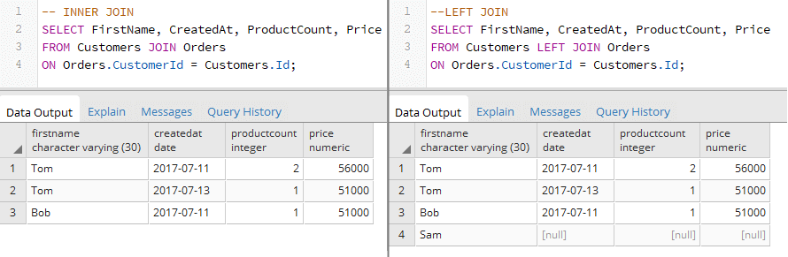
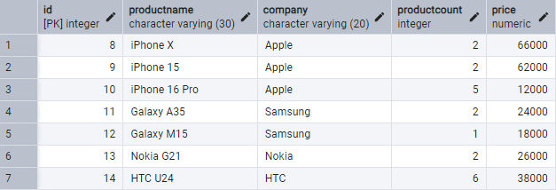
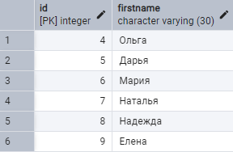
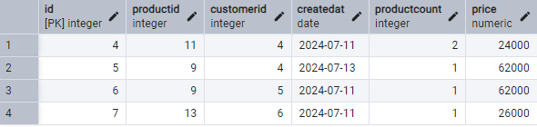
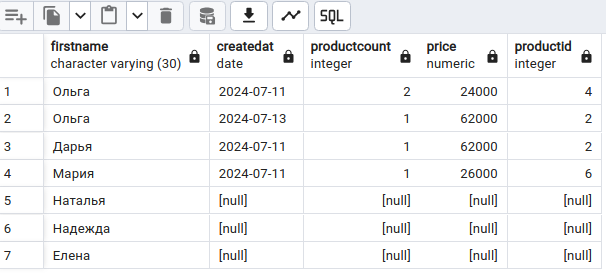
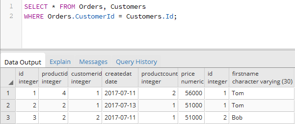
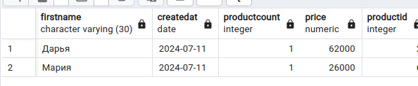
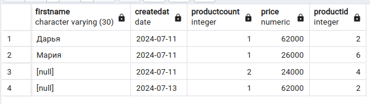
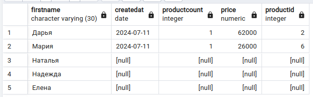

# FULL JOIN

### Создайте следующие три таблицы, которые связаны между собой связями:

```sql
CREATE TABLE Products
(
    Id SERIAL PRIMARY KEY,
    ProductName VARCHAR(30) NOT NULL,
    Company VARCHAR(20) NOT NULL,
    ProductCount INTEGER DEFAULT 0,
    Price NUMERIC NOT NULL
);
CREATE TABLE Customers
(
    Id SERIAL PRIMARY KEY,
    FirstName VARCHAR(30) NOT NULL
);
CREATE TABLE Orders
(
    Id SERIAL PRIMARY KEY,
    ProductId INTEGER REFERENCES Products(Id) ON DELETE SET NULL,
    CustomerId INTEGER REFERENCES Customers(Id) ON DELETE SET NULL,
    CreatedAt DATE NOT NULL,
    ProductCount INTEGER DEFAULT 1,
    Price NUMERIC NOT NULL
);
```

В данном случае таблицы `Customers` и `Products` связаны с таблицей `Orders` связью один ко многим. 

Таблица `Orders` в виде внешних ключей `ProductId` и `CustomerId` содержит ссылки на столбцы `Id` из соответственно таблиц `Products` и `Customers`. 

Также она хранит количество купленного товара `ProductCount` и и по какой цене он был куплен `Price`. 

И кроме того, таблицы также хранит в виде столбца `CreatedAt` дату покупки.




<a name="source_tables">
Заполните таблицы данными:
</a>


```sql
INSERT INTO Products(ProductName, Company, ProductCount, Price) 
VALUES 
    ('iPhone X', 'Apple', 2, 66000),
    ('iPhone 15', 'Apple', 2, 62000),
    ('iPhone 16 Pro', 'Apple', 5, 12000),
    ('Galaxy A35', 'Samsung', 2, 24000),
    ('Galaxy M15', 'Samsung', 1, 18000),
    ('Nokia G21', 'Nokia', 2, 26000),
    ('HTC U24', 'HTC', 6, 38000);
  
INSERT INTO Customers(FirstName) 
VALUES 
    ('Ольга'), 
    ('Дарья'),
    ('Мария'),
    ('Наталья'),
    ('Надежда'),
    ('Елена');
  
INSERT INTO Orders(ProductId, CustomerId, CreatedAt, ProductCount, Price) 
VALUES
( 
    (SELECT Id FROM Products WHERE ProductName='Galaxy A35'), 
    (SELECT Id FROM Customers WHERE FirstName='Ольга'),
    '2024-07-11',  
    2, 
    (SELECT Price FROM Products WHERE ProductName='Galaxy A35')
),
( 
    (SELECT Id FROM Products WHERE ProductName='iPhone 15'), 
    (SELECT Id FROM Customers WHERE FirstName='Ольга'),
    '2024-07-13',  
    1, 
    (SELECT Price FROM Products WHERE ProductName='iPhone 15')
),
( 
    (SELECT Id FROM Products WHERE ProductName='iPhone 15'), 
    (SELECT Id FROM Customers WHERE FirstName='Дарья'),
    '2024-07-11',  
    1, 
    (SELECT Price FROM Products WHERE ProductName='iPhone 15')
),
( 
    (SELECT Id FROM Products WHERE ProductName='Nokia G21'), 
    (SELECT Id FROM Customers WHERE FirstName='Мария'),
    '2024-07-11',  
    1, 
    (SELECT Price FROM Products WHERE ProductName='Nokia G21')
);

```








### Задание 1. Объедините обе таблицы с помощью `FULL JOIN`:

```sql
SELECT FirstName, CreatedAt, ProductCount, Price, ProductId 
	FROM Orders
	FULL JOIN Customers 
		ON Orders.CustomerId = Customers.Id
```



Удалите покупателя

```sql
DELETE FROM customers WHERE firstname ='Ольга';

```




## поменяйте FULL JOIN на INNER JOIN 





## поменяйте INNER JOIN на LEFT JOIN



## поменяйте LEFT JOIN на RIGHT JOIN




## поменяйте RIGHT JOIN на JOIN

## поменяйте RIGHT JOIN на JOIN

