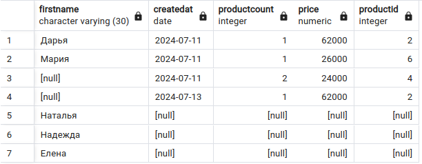
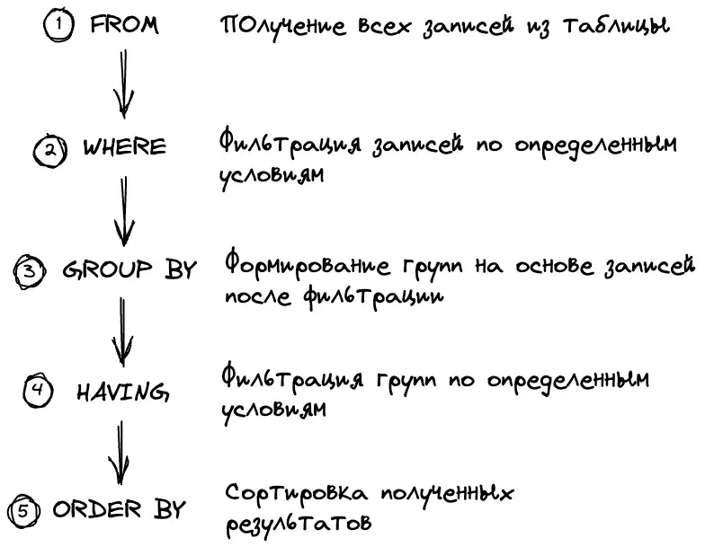

# FULL JOIN

### Создайте следующие три таблицы, которые связаны между собой связями:

```sql
CREATE TABLE Products
(
    Id SERIAL PRIMARY KEY,
    ProductName VARCHAR(30) NOT NULL,
    Company VARCHAR(20) NOT NULL,
    ProductCount INTEGER DEFAULT 0,
    Price NUMERIC NOT NULL
);
CREATE TABLE Customers
(
    Id SERIAL PRIMARY KEY,
    FirstName VARCHAR(30) NOT NULL
);
CREATE TABLE Orders
(
    Id SERIAL PRIMARY KEY,
    ProductId INTEGER REFERENCES Products(Id) ON DELETE SET NULL,
    CustomerId INTEGER REFERENCES Customers(Id) ON DELETE SET NULL,
    CreatedAt DATE NOT NULL,
    ProductCount INTEGER DEFAULT 1,
    Price NUMERIC NOT NULL
);
```

В данном случае таблицы `Customers` и `Products` связаны с таблицей `Orders` связью один ко многим. 

Таблица `Orders` в виде внешних ключей `ProductId` и `CustomerId` содержит ссылки на столбцы `Id` из соответственно таблиц `Products` и `Customers`. 

Также она хранит количество купленного товара `ProductCount` и и по какой цене он был куплен `Price`. 

И кроме того, таблицы также хранит в виде столбца `CreatedAt` дату покупки.


<a name="source_tables">
Заполните таблицы данными:
</a>


```sql
INSERT INTO Products(ProductName, Company, ProductCount, Price) 
VALUES 
    ('iPhone X', 'Apple', 2, 66000),
    ('iPhone 15', 'Apple', 2, 62000),
    ('iPhone 16 Pro', 'Apple', 5, 12000),
    ('Galaxy A35', 'Samsung', 2, 24000),
    ('Galaxy M15', 'Samsung', 1, 18000),
    ('Nokia G21', 'Nokia', 2, 26000),
    ('HTC U24', 'HTC', 6, 38000);
  
INSERT INTO Customers(FirstName) 
VALUES 
    ('Ольга'), 
    ('Дарья'),
    ('Мария'),
    ('Наталья'),
    ('Надежда'),
    ('Елена');
  
INSERT INTO Orders(ProductId, CustomerId, CreatedAt, ProductCount, Price) 
VALUES
( 
    (SELECT Id FROM Products WHERE ProductName='Galaxy A35'), 
    (SELECT Id FROM Customers WHERE FirstName='Ольга'),
    '2024-07-11',  
    2, 
    (SELECT Price FROM Products WHERE ProductName='Galaxy A35')
),
( 
    (SELECT Id FROM Products WHERE ProductName='iPhone 15'), 
    (SELECT Id FROM Customers WHERE FirstName='Ольга'),
    '2024-07-13',  
    1, 
    (SELECT Price FROM Products WHERE ProductName='iPhone 15')
),
( 
    (SELECT Id FROM Products WHERE ProductName='iPhone 15'), 
    (SELECT Id FROM Customers WHERE FirstName='Дарья'),
    '2024-07-11',  
    1, 
    (SELECT Price FROM Products WHERE ProductName='iPhone 15')
),
( 
    (SELECT Id FROM Products WHERE ProductName='Nokia G21'), 
    (SELECT Id FROM Customers WHERE FirstName='Мария'),
    '2024-07-11',  
    1, 
    (SELECT Price FROM Products WHERE ProductName='Nokia G21')
);

```


### Задание 1. Объедините обе таблицы с помощью `FULL JOIN`:

```sql
SELECT FirstName, CreatedAt, ProductCount, Price, ProductId 
	FROM Orders
	FULL JOIN Customers 
		ON Orders.CustomerId = Customers.Id
```


Удалите покупателя

```sql
DELETE FROM customers WHERE firstname ='Ольга';

```




### Задание 2. Поменяйте FULL JOIN на INNER JOIN 


### Задание 3. Поменяйте INNER JOIN на LEFT JOIN


### Задание 4. Поменяйте LEFT JOIN на RIGHT JOIN


## Поменяйте RIGHT JOIN на JOIN

### Задание 5. Выберите  всех пользователей из `Customers`, у которых нет заказов в таблице `Orders`:

```sql
SELECT FirstName
	FROM Customers
	LEFT JOIN Orders
		ON Customers.Id = Orders.CustomerId
	WHERE Orders.CustomerId IS NULL;
```


Также можно комбинировать `Inner Join` и `Outer Join`:


```sql
SELECT Customers.FirstName, Orders.CreatedAt, Products.ProductName, Products.Company

	FROM Orders 
	JOIN Products
		ON Orders.ProductId = Products.Id AND Products.Price > 25000
	LEFT JOIN Customers 
	ON Orders.CustomerId = Customers.Id

ORDER BY Orders.CreatedAt;

```


Вначале по условию к таблице `Orders` через `Inner Join` присоединяется связанная информация из `Products`, затем через `Outer Join` добавляется информация из таблицы `Customers`.

# Cross Join

`Cross Join` или перекрестное соединение создает набор строк, где каждая строка из одной таблицы соединяется с каждой строкой из второй таблицы. 

### Задание 6. Соедините таблицу заказов `Orders` и таблицу покупателей `Customers`:

```sql
SELECT * FROM Orders
CROSS JOIN Customers;
```


Если в таблице `Orders` 3 строки, а в таблице `Customers` то же три строки, то в результате перекрестного соединения создается `... * ... = ...` строк вне зависимости, связаны ли данные строки или нет.

При неявном перекрестном соединении можно опустить оператор `CROSS JOIN` и просто перечислить все получаемые таблицы:

```sql
SELECT * FROM Orders, Customers;
```


# Группировка в соединениях

Более сложным вариантом использования соединений `INNER/OUTER JOIN` представляет их сочетание с выражениями группировки, в частности, с оператором `GROUP BY`. 

### Задание 7. Вывести для каждого покупателя количество заказов, которые он сделал:

```sql
SELECT FirstName, COUNT(Orders.Id)
	FROM Customers
	JOIN Orders 
		ON Orders.CustomerId = Customers.Id
GROUP BY Customers.Id, Customers.FirstName;
```


Критерием группировки выступают `Id` и имя покупателя. 
Выражение `SELECT` выбирает имя покупателя и количество заказов, используя столбец `Id` из таблицы `Orders`.

Так как это `INNER JOIN`, то в группах будут только те покупатели, у которых есть заказы.

### Задание 8. Получить покупателей, у которых нет заказов с помощью OUTER JOIN:

```sql
SELECT FirstName, COUNT(Orders.Id) 
FROM Customers LEFT JOIN Orders 
ON Orders.CustomerId = Customers.Id
GROUP BY Customers.Id, Customers.FirstName
HAVING COUNT(Orders.Id) > 0;

```



```
from —> where —> group by —> having —> select —> order by —> distinct —> top
```


### Задание 9. Dыведите товары с общей суммой сделанных заказов:

```sql
SELECT Products.ProductName, Products.Company, SUM(Orders.ProductCount * Orders.Price) AS TotalSum
	FROM Products
	LEFT JOIN Orders
		ON Orders.ProductId = Products.Id 
GROUP BY Products.Id, Products.ProductName, Products.Company
HAVING SUM(Orders.ProductCount * Orders.Price) is NOT NULL
ORDER by TotalSum

```


