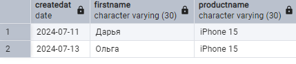

## Создание и наполнение таблиц из текстовых файлов и входящего потока stdin 


```sql
CREATE TABLE table_colors (
    id integer NOT NULL,
    code text
);

\COPY table_colors (id, code) FROM 'C:\Users\user\Documents\colors.txt' ; ;
\copy table_colors (id, code) from '/home/student/Documents/colors.txt';

```

```txt
1	красный
2	зеленый
3	синий
4	белый
```

## stdin (в psql-терминале) 

```sql
COPY table_colors (id, code) FROM stdin;
1	красный
2	зеленый
3	синий
4	белый
5	\N
6	\N
\.
```




```csv
productname,Company,productCount,price
iPhone 16 Pro,Apple,5,12000
Galaxy A35,Samsung,2,24000
Nokia G21,Nokia,2,26000
HTC U24,HTC,6,38000
```


\copy products from '/home/student/Documents/products.csv'' delimiter ',' encoding 'utf-8' csv header;

\copy products from '/home/student/Documents/products.csv' delimiter ',' encoding 'utf-8' csv header;

\copy products (productname, Company, productCount, price) from '/home/student/Documents/products.csv';