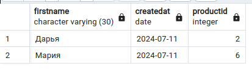

## Представления

Представление — запрос, у которого есть имя. Например, можно создать представление, которое показывает следующее:

```sql
CREATE VIEW customers_with_id AS
SELECT 'Клиент: '|| firstname || ' c ID = ' || id
FROM customers;

```


```sql
SELECT *  from customers_with_id; 
```


```sql
CREATE VIEW view_orders AS
SELECT FirstName, CreatedAt, ProductCount, Price, ProductId 
	FROM Orders
	INNER JOIN Customers 
		ON Orders.CustomerId = Customers.Id;

```


```sql
SELECT firstname, createdat, productid from view_orders;

```




```sql
CREATE VIEW products_v AS
	SELECT productname,
	CASE
		WHEN productcount < 3 THEN 'Мало'
		ELSE 'Достаточно'
	END 
	FROM products;
```


```sql
SELECT * FROM products_v;

```