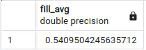

# Подпрограммы

### Функции

* вызываются в контексте выражения
* не могут управлять транзакциями
* возвращают результат

###  Процедуры

* вызываются оператором CALL
* могут управлять транзакциями
* могут возвращать результат


Процедуры были введены в PostgreSQL 11.

Основная причина их появления состоит в том, что функции не могут управлять транзакциями. 

Функции вызываются в контексте какого-либо выражения, которое вычисляется как часть уже начатого оператора
(например, SELECT) в уже начатой транзакции. 

Нельзя завершить транзакцию и начать новую «посередине» выполнения оператора.

Процедуры всегда вызываются специальным оператором CALL.

Если этот оператор сам начинает новую транзакцию (а не вызывается из уже начатой), то в процедуре можно использовать команды управления транзакциями.


Иногда можно услышать, что процедура отличается от функции тем, что не возвращает результат. 
Но это не так — процедуры тоже могут возвращать результат, если необходимо.

Функции и процедуры имеют общее пространство имен и вместе называются подпрограммами (routine).

## Процедуры без параметров


Начнем с примера простой процедуры без параметров.

```sql
CREATE TABLE t(a float);

CREATE or REPLACE PROCEDURE fill()
AS $$
TRUNCATE t;
INSERT INTO t SELECT random() FROM generate_series(1,3);
$$ LANGUAGE sql;

call fill();

TABLE t;
```


А теперь переопределим нашу процедуру в стиле стандарта `SQL`:

```sql
CREATE OR REPLACE PROCEDURE fill()
BEGIN ATOMIC
    DELETE FROM t; -- команда TRUNCATE пока что не поддерживается в таких подпрограммах
    INSERT INTO t SELECT random() FROM generate_series(1,3);
END;


call fill();

TABLE t;
```


## Процедуры с параметрам

```sql
CREATE or REPLACE PROCEDURE fill(nrows integer)
BEGIN ATOMIC
	DELETE FROM t;
	INSERT INTO t SELECT random() FROM generate_series(1, nrows);
END;

Точно так же, как и в случае функций, при вызове процедур фактические параметры можно передавать
позиционным способом или по имени


CALL fill(nrows => 5);

TABLE t;

```


Процедуры могут также иметь `OUT- и INOUT-параметры`, с помощью которых можно возвращать


```sql
CREATE or REPLACE PROCEDURE fill_2(IN nrows integer, OUT average float)
BEGIN ATOMIC
	DELETE FROM t;
	INSERT INTO t SELECT random() FROM generate_series(1, nrows);
	SELECT avg(a) FROM t; 
END;

CALL fill_2(5, NULL /* значение не используется, но его необходимо указать*/);
CALL fill_2(10,0);

```


## отличие функции от процедуры

```sql
CREATE or REPLACE FUNCTION fill_avg() RETURNS float
BEGIN ATOMIC
	DELETE FROM t;
	INSERT INTO t SELECT random() FROM generate_series(1, 3);
	SELECT avg(a) FROM t;
END;

select fill_avg();
```




## Задача Напишите процедуру, удаляющую продукты компаний указанные в ее вызове

к примеру 

```sql
CALL del_company('Apple');
```


```sql
CREATE or REPLACE PROCEDURE del_company(in name_company text)
BEGIN ATOMIC
	DELETE FROM products
	WHERE Company=name_company;	
END;


```