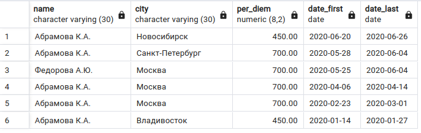
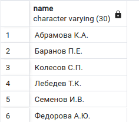
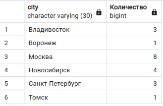
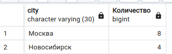
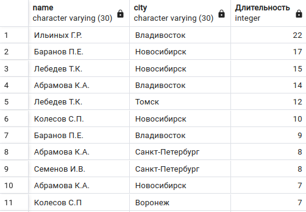
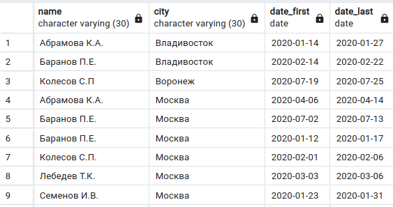
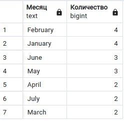
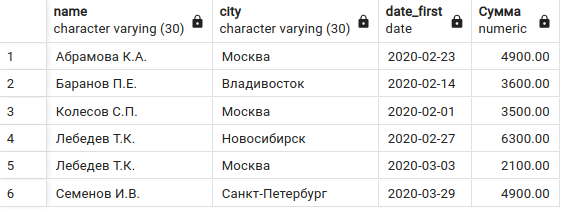
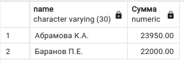

## База данных 

Таблица `trip`, в которой представлена информация о командировках сотрудников некоторой организации (фамилия сотрудника, город, куда он ездил, размер суточных, даты первого и последнего дня командировки) :

```sql
CREATE TABLE trip (
    trip_id SERIAL PRIMARY KEY,
    name VARCHAR(30),
    city VARCHAR(30),
    per_diem DECIMAL (8, 2),
    date_first DATE,
    date_last DATE
);

INSERT INTO trip (name, city, per_diem, date_first, date_last) VALUES 
    ('Баранов П.Е.', 'Москва', 700, '2020-01-12', '2020-01-17'),
    ('Абрамова К.А.', 'Владивосток', 450, '2020-01-14', '2020-01-27'),
    ('Семенов И.В.', 'Москва', 700, '2020-01-23', '2020-01-31'),
    ('Ильиных Г.Р.', 'Владивосток', 450, '2020-01-12', '2020-02-02'),
    ('Колесов С.П.', 'Москва', 700, '2020-02-01', '2020-02-06'),
    ('Баранов П.Е.', 'Владивосток', 450, '2020-02-14', '2020-02-22'),
    ('Абрамова К.А.', 'Москва', 700, '2020-02-23', '2020-03-01'),
    ('Лебедев Т.К.', 'Москва', 700, '2020-03-03', '2020-03-06'),
    ('Лебедев Т.К.', 'Новосибирск', 450, '2020-02-27', '2020-03-12'),
    ('Семенов И.В.', 'Санкт-Петербург    ', 700, '2020-03-29', '2020-04-05'),
    ('Абрамова К.А.', 'Москва', 700, '2020-04-06', '2020-04-14'),
    ('Баранов П.Е.', 'Новосибирск', 450, '2020-04-18', '2020-05-04'),
    ('Лебедев Т.К.', 'Томск', 450, '2020-05-20', '2020-05-31'),
    ('Семенов И.В.', 'Санкт-Петербург    ', 700, '2020-06-01', '2020-06-03'),
    ('Абрамова К.А.', 'Санкт-Петербург    ', 700, '2020-05-28', '2020-06-04'),
    ('Федорова А.Ю.', 'Москва', 700, '2020-05-25', '2020-06-04'),
    ('Колесов С.П.', 'Новосибирск', 450, '2020-06-03', '2020-06-12'),
    ('Абрамова К.А.', 'Новосибирск', 450, '2020-06-20', '2020-06-26'),
    ('Баранов П.Е.', 'Москва', 700, '2020-07-02', '2020-07-13'),
    ('Колесов С.П', 'Воронеж', 450, '2020-07-19', '2020-07-25');  

```

## Задача 1. Вывести из таблицы trip информацию о командировках тех сотрудников, фамилия которых заканчивается на букву «а», в отсортированном по убыванию даты последнего дня командировки виде. 

В результат включить столбцы name, city, per_diem, date_first, date_last.



## Задача 2. Вывести в алфавитном порядке фамилии и инициалы тех сотрудников, которые были в командировке в Москве.



## Задача 3. Для каждого города посчитать, сколько раз сотрудники в нем были.  
Информацию вывести в отсортированном в алфавитном порядке по названию городов. Вычисляемый столбец назвать Количество. 



## Задача 4. Вывести информацию о первой  командировке из таблицы trip. 
"Первой" считать командировку с самой ранней датой начала.


## Задача 5. Вывести два города, в которых чаще всего были в командировках сотрудники. 
Вычисляемый столбец назвать Количество.




## Задача 6. Вывести информацию о командировках во все города кроме Москвы и Санкт-Петербурга (фамилии и инициалы сотрудников, город ,  длительность командировки в днях, при этом первый и последний день относится к периоду командировки). 
Последний столбец назвать Длительность. Информацию вывести в упорядоченном по убыванию длительности поездки, а потом по убыванию названий городов (в обратном алфавитном порядке).



## Задача 7. Вывести информацию о командировках сотрудника(ов), которые были самыми короткими по времени. 
В результат включить столбцы name, city, date_first, date_last


## Задача 8. Вывести информацию о командировках, начало и конец которых относятся к одному месяцу (год может быть любой).
В результат включить столбцы `name, city, date_first, date_last`. 
Строки отсортировать сначала  в алфавитном порядке по названию города, а затем по фамилии сотрудника .




## Задача 9. Вывести название месяца и количество командировок для каждого месяца. 
Считаем, что командировка относится к некоторому месяцу, если она началась в этом месяце.
Информацию вывести сначала в отсортированном по убыванию количества, а потом в алфавитном порядке по названию месяца виде. 
Название столбцов – Месяц и Количество.




## Задача 10. Вывести сумму суточных (произведение количества дней командировки и размера суточных) для командировок, первый день которых пришелся на февраль или март 2020 года. 
Значение суточных для каждой командировки занесено в столбец per_diem. 
Вывести фамилию и инициалы сотрудника, город, первый день командировки и сумму суточных. 
Последний столбец назвать Сумма. 
Информацию отсортировать сначала  в алфавитном порядке по фамилиям сотрудников, а затем по убыванию суммы суточных.



## Задача 11. Вывести фамилию с инициалами и общую сумму суточных, 
полученных за все командировки для тех сотрудников, которые были в командировках больше чем 3 раза, в отсортированном по убыванию сумм суточных виде. Последний столбец назвать Сумма.


