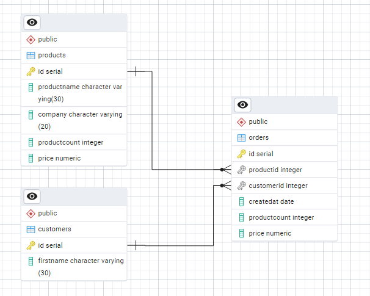
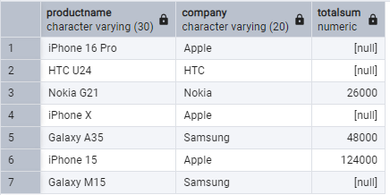
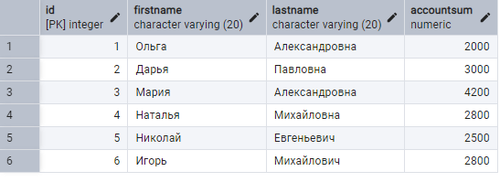
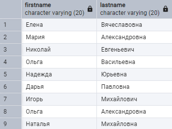
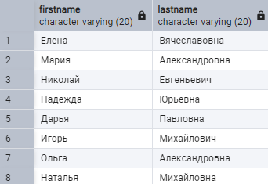
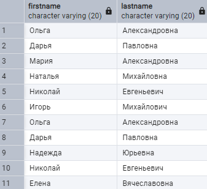
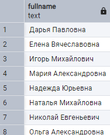
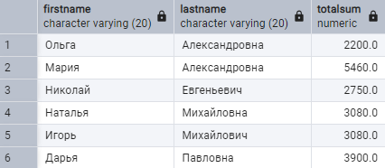

# Соединение таблиц
## Неявное соединение таблиц


Нередко возникает ситуация, когда нам надо получить данные из нескольких таблиц. 

Для соединения данных из разных таблиц можно использовать команду `SELECT`. 

Например, пусть имеются следующие таблицы, которые связаны между собой связями:

```sql
CREATE TABLE Products
(
    Id SERIAL PRIMARY KEY,
    ProductName VARCHAR(30) NOT NULL,
    Company VARCHAR(20) NOT NULL,
    ProductCount INTEGER DEFAULT 0,
    Price NUMERIC NOT NULL
);
CREATE TABLE Customers
(
    Id SERIAL PRIMARY KEY,
    FirstName VARCHAR(30) NOT NULL
);
CREATE TABLE Orders
(
    Id SERIAL PRIMARY KEY,
    ProductId INTEGER NOT NULL REFERENCES Products(Id) ON DELETE CASCADE,
    CustomerId INTEGER NOT NULL REFERENCES Customers(Id) ON DELETE CASCADE,
    CreatedAt DATE NOT NULL,
    ProductCount INTEGER DEFAULT 1,
    Price NUMERIC NOT NULL
);
```


В данном случае таблицы `Customers` и `Products` связаны с таблицей Orders связью один ко многим. 

Таблица `Orders` в виде внешних ключей `ProductId` и `CustomerId` содержит ссылки на столбцы `Id` из соответственно таблиц `Products` и `Customers`. 

Также она хранит количество купленного товара `ProductCount` и и по какой цене он был куплен `Price`. 

И кроме того, таблицы также хранит в виде столбца `CreatedAt` дату покупки.




Пусть эти таблицы будут содержать следующие данные:


```sql
INSERT INTO Products(ProductName, Company, ProductCount, Price) 
VALUES ('iPhone X', 'Apple', 2, 66000),
('iPhone 8', 'Apple', 2, 51000),
('iPhone 7', 'Apple', 5, 42000),
('Galaxy S9', 'Samsung', 2, 56000),
('Galaxy S8 Plus', 'Samsung', 1, 46000),
('Nokia 9', 'HDM Global', 2, 26000),
('Desire 12', 'HTC', 6, 38000);
  
INSERT INTO Customers(FirstName) 
VALUES ('Tom'), ('Bob'),('Sam');
  
INSERT INTO Orders(ProductId, CustomerId, CreatedAt, ProductCount, Price) 
VALUES
( 
    (SELECT Id FROM Products WHERE ProductName='Galaxy S9'), 
    (SELECT Id FROM Customers WHERE FirstName='Tom'),
    '2017-07-11',  
    2, 
    (SELECT Price FROM Products WHERE ProductName='Galaxy S9')
),
( 
    (SELECT Id FROM Products WHERE ProductName='iPhone 8'), 
    (SELECT Id FROM Customers WHERE FirstName='Tom'),
    '2017-07-13',  
    1, 
    (SELECT Price FROM Products WHERE ProductName='iPhone 8')
),
( 
    (SELECT Id FROM Products WHERE ProductName='iPhone 8'), 
    (SELECT Id FROM Customers WHERE FirstName='Bob'),
    '2017-07-11',  
    1, 
    (SELECT Price FROM Products WHERE ProductName='iPhone 8')
);
```


Теперь соединим две таблицы Orders и Customers:

```sql
SELECT * FROM Orders, Customers;
```
При такой выборке для каждая строка из таблицы Orders будет совмещаться с каждой строкой из таблицы Customers. То есть, получится перекрестное соединение. 

Например, в Orders три строки, а в Customers то же три строки, значит мы получим 3 * 3 = 9 строк:


То есть в данном случае мы получаем прямое (декартово) произведение двух групп. Однако вряд ли такой результат можно назвать желаемым. Тем более каждый заказ из Orders связан с конкретным покупателем из Customers, а не со всеми возможными покупателями.

Для решения этой задачи необходимо использовать выражение WHERE и фильтровать строки при условии, что поле CustomerId из Orders соответствует полю Id из Customers:

```sql
SELECT * FROM Orders, Customers
WHERE Orders.CustomerId = Customers.Id;
```


Теперь объединим данные по трем таблицам Orders, Customers и Proucts. То есть получим все заказы и добавим информацию по клиенту и связанному товару:

```sql
SELECT Customers.FirstName, Products.ProductName, Orders.CreatedAt 
FROM Orders, Customers, Products
WHERE Orders.CustomerId = Customers.Id AND Orders.ProductId=Products.Id;
```

Так как здесь соединяются три таблицы, то необходимо применить как минимум два условия. Ключевой таблицей остается Orders, из которой извлекаются все заказы, а затем к ней подсоединяются данные по клиенту по условию Orders.CustomerId = Customers.Id и данные по товару по условию Orders.ProductId=Products.Id


Поскольку в данном случае названия таблиц сильно увеличивают код, то мы его можем сократить за счет использования псевдонимов таблиц:


```sql
SELECT C.FirstName, P.ProductName, O.CreatedAt 
FROM Orders AS O, Customers AS C, Products AS P
WHERE O.CustomerId = C.Id AND O.ProductId=P.Id;
```

Если необходимо при использовании псевдонима выбрать все столбцы из определенной таблицы, то можно использовать звездочку:

```sql
SELECT C.FirstName, P.ProductName, O.*
FROM Orders AS O, Customers AS C, Products AS P
WHERE O.CustomerId = C.Id AND O.ProductId=P.Id;
```

# INNER JOIN

Еще одним способом соединения таблиц является использование оператора JOIN или INNER JOIN. Он представляет так называемое внутренее соединение. Его формальный синтаксис:

```sql
SELECT столбцы
FROM таблица1
    [INNER] JOIN таблица2
    ON условие1
    [[INNER] JOIN таблица3
    ON условие2]
```

После оператора JOIN идет название второй таблицы, данные которой надо добавить в выборку. 

Перед JOIN можно указывать необязательный оператор INNER. 

Его наличие или отсутствие ни на что не влияет. 

Далее после ключевого слова ON указывается условие соединения. 

Это условие устанавливает, как две таблицы будут сравниваться. 

Как правило, для соединения применяется первичный ключ главной таблицы и внешний ключ зависимой таблицы.

Возьмем таблицы с данными из прошлой темы:

```sql
CREATE TABLE Products
(
    Id SERIAL PRIMARY KEY,
    ProductName VARCHAR(30) NOT NULL,
    Company VARCHAR(20) NOT NULL,
    ProductCount INTEGER DEFAULT 0,
    Price NUMERIC NOT NULL
);
CREATE TABLE Customers
(
    Id SERIAL PRIMARY KEY,
    FirstName VARCHAR(30) NOT NULL
);
CREATE TABLE Orders
(
    Id SERIAL PRIMARY KEY,
    ProductId INTEGER NOT NULL REFERENCES Products(Id) ON DELETE CASCADE,
    CustomerId INTEGER NOT NULL REFERENCES Customers(Id) ON DELETE CASCADE,
    CreatedAt DATE NOT NULL,
    ProductCount INTEGER DEFAULT 1,
    Price NUMERIC NOT NULL
);
```

Используя JOIN, выберем все заказы и добавим к ним информацию о товарах:

```sql
SELECT Orders.CreatedAt, Orders.ProductCount, Products.ProductName 
FROM Orders
JOIN Products ON Products.Id = Orders.ProductId;
```

Поскольку таблицы могут содержать столбцы с одинаковыми названиями, то при указании столбцов для выборки указывается их полное имя вместе с именем таблицы, например, "Orders.ProductCount".


С помощью псевдонимов, определяемых через оператор AS, можно сократить код:


```sql
SELECT O.CreatedAt, O.ProductCount, P.ProductName 
FROM Orders AS O
JOIN Products AS P
ON P.Id = O.ProductId;
```

Подобным образом мы можем присоединять и другие таблицы. Например, добавим к заказу информацию о покупателе из таблицы Customers:

```sql
SELECT Orders.CreatedAt, Customers.FirstName, Products.ProductName 
FROM Orders
JOIN Products ON Products.Id = Orders.ProductId
JOIN Customers ON Customers.Id=Orders.CustomerId;
```


Благодаря соединению таблиц мы можем использовать их столбцы для фильтрации выборки или ее сортировки:

```sql
SELECT Orders.CreatedAt, Customers.FirstName, Products.ProductName 
FROM Orders
JOIN Products ON Products.Id = Orders.ProductId
JOIN Customers ON Customers.Id=Orders.CustomerId
WHERE Products.Price > 45000
ORDER BY Customers.FirstName;
```

Условия после ключевого слова ON могут быть более сложными по составу. Например, выбирем все заказы на товары, производителем которых является Apple.

```sql
SELECT Orders.CreatedAt, Customers.FirstName, Products.ProductName 
FROM Orders
JOIN Products ON Products.Id = Orders.ProductId AND Products.Company='Apple'
JOIN Customers ON Customers.Id=Orders.CustomerId
ORDER BY Customers.FirstName;
```


# OUTER JOIN и CROSS JOIN

OUTER JOIN или внешнее соединение позволяет возвратить все строки одной или двух таблиц, которые участвуют в соединении.

Outer Join имеет следующий формальный синтаксис:

```sql
SELECT столбцы
FROM таблица1
    {LEFT|RIGHT|FULL} [OUTER] JOIN таблица2 ON условие1
    [{LEFT|RIGHT|FULL} [OUTER] JOIN таблица3 ON условие2]...
```

Перед оператором JOIN указывается одно из ключевых слов LEFT, RIGHT или FULL, которые определяют тип соединения:

LEFT: выборка будет содержать все строки из первой или левой таблицы

RIGHT: выборка будет содержать все строки из второй или правой таблицы

FULL: выборка будет содержать все строки из обеих таблиц

Перед оператором JOIN может указываться ключевое слово OUTER, но его применение необязательно. После JOIN указывается присоединяемая таблица, а затем идет условие соединения после оператора ON.

К примеру, возьмем следующие таблицы:

```sql
CREATE TABLE Products
(
    Id SERIAL PRIMARY KEY,
    ProductName VARCHAR(30) NOT NULL,
    Company VARCHAR(20) NOT NULL,
    ProductCount INTEGER DEFAULT 0,
    Price NUMERIC NOT NULL
);
CREATE TABLE Customers
(
    Id SERIAL PRIMARY KEY,
    FirstName VARCHAR(30) NOT NULL
);
CREATE TABLE Orders
(
    Id SERIAL PRIMARY KEY,
    ProductId INTEGER NOT NULL REFERENCES Products(Id) ON DELETE CASCADE,
    CustomerId INTEGER NOT NULL REFERENCES Customers(Id) ON DELETE CASCADE,
    CreatedAt DATE NOT NULL,
    ProductCount INTEGER DEFAULT 1,
    Price NUMERIC NOT NULL
);

```

И соединим таблицы Orders и Customers:

```sql
SELECT FirstName, CreatedAt, ProductCount, Price, ProductId 
FROM Orders LEFT JOIN Customers 
ON Orders.CustomerId = Customers.Id;
```

Таблица Orders является первой или левой таблицей, а таблица Customers - правой таблицей. Поэтому, так как здесь используется выборка по левой таблице, то вначале будут выбираться все строки из Orders, а затем к ним по условию Orders.CustomerId = Customers.Id будут добавляться связанные строки из Customers.


По вышеприведенному результату может показаться, что левостороннее соединение аналогично INNER Join, но это не так. Inner Join объединяет строки из дух таблиц при соответствии условию. Если одна из таблиц содержит строки, которые не соответствуют этому условию, то данные строки не включаются в выходную выборку. Left Join выбирает все строки первой таблицы и затем присоединяет к ним строки правой таблицы. К примеру, возьмем таблицу Customers и добавим к покупателям информацию об их заказах:


```sql
-- INNER JOIN
SELECT FirstName, CreatedAt, ProductCount, Price 
FROM Customers JOIN Orders 
ON Orders.CustomerId = Customers.Id;
 
--LEFT JOIN
SELECT FirstName, CreatedAt, ProductCount, Price 
FROM Customers LEFT JOIN Orders 
ON Orders.CustomerId = Customers.Id;

```


Изменим в примере выше тип соединения на правостороннее:

```sql
SELECT FirstName, CreatedAt, ProductCount, Price, ProductId 
FROM Orders RIGHT JOIN Customers 
ON Orders.CustomerId = Customers.Id;

```

Теперь будут выбираться все строки из Customers, а к ним уже будет присоединяться связанные по условию строки из таблицы Orders:


Поскольку один из покупателей из таблицы Customers не имеет связанных заказов из Orders, то соответствующие столбцы, которые берутся из Orders, будут иметь значение NULL.

Полное соединение (FULL JOIN) объединяет обе таблицы:

```sql
SELECT FirstName, CreatedAt, ProductCount, Price, ProductId 
FROM Orders FULL JOIN Customers 
ON Orders.CustomerId = Customers.Id;
```


Используем левостороннее соединение для добавления к заказам информации о пользователях и товарах:

```sql
SELECT Customers.FirstName, Orders.CreatedAt, 
       Products.ProductName, Products.Company
FROM Orders 
LEFT JOIN Customers ON Orders.CustomerId = Customers.Id
LEFT JOIN Products ON Orders.ProductId = Products.Id;
```


И также можно применять более комплексные условия с фильтрацией и сортировкой. Например, выберем все заказы с информацией о клиентах и товарах по тем товарам, у которых цена больше 55000, и отсортируем по дате заказа:


```sql
SELECT Customers.FirstName, Orders.CreatedAt, 
       Products.ProductName, Products.Company
FROM Orders 
LEFT JOIN Customers ON Orders.CustomerId = Customers.Id
LEFT JOIN Products ON Orders.ProductId = Products.Id
WHERE Products.Price > 55000
ORDER BY Orders.CreatedAt;

```


Или выберем всех пользователей из Customers, у которых нет заказов в таблице Orders:

```sql
SELECT FirstName FROM Customers
LEFT JOIN Orders ON Customers.Id = Orders.CustomerId
WHERE Orders.CustomerId IS NULL;
```

Также можно комбинировать Inner Join и Outer Join:


```sql
SELECT Customers.FirstName, Orders.CreatedAt, 
       Products.ProductName, Products.Company
FROM Orders 
JOIN Products ON Orders.ProductId = Products.Id AND Products.Price > 45000
LEFT JOIN Customers ON Orders.CustomerId = Customers.Id
ORDER BY Orders.CreatedAt;

```


Вначале по условию к таблице Orders через Inner Join присоединяется связанная информация из Products, затем через Outer Join добавляется информация из таблицы Customers.

# Cross Join

Cross Join или перекрестное соединение создает набор строк, где каждая строка из одной таблицы соединяется с каждой строкой из второй таблицы. Например, соединим таблицу заказов Orders и таблицу покупателей Customers:

```sql
SELECT * FROM Orders CROSS JOIN Customers;
```


Если в таблице Orders 3 строки, а в таблице Customers то же три строки, то в результате перекрестного соединения создается 3 * 3 = 9 строк вне зависимости, связаны ли данные строки или нет.

При неявном перекрестном соединении можно опустить оператор CROSS JOIN и просто перечислить все получаемые таблицы:

```sql
SELECT * FROM Orders, Customers;
```


# Группировка в соединениях

Более сложным вариантом использования соединений INNER/OUTER JOIN представляет их сочетание с выражениями группировки, в частности, с оператором GROUP BY. Например, выведем для каждого покупателя количество заказов, которые он сделал:

```sql
SELECT FirstName, COUNT(Orders.Id)
FROM Customers JOIN Orders 
ON Orders.CustomerId = Customers.Id
GROUP BY Customers.Id, Customers.FirstName;
```






Критерием группировки выступают Id и имя покупателя. Выражение SELECT выбирает имя покупателя и количество заказов, используя столбец Id из таблицы Orders.

Так как это INNER JOIN, то в группах будут только те покупатели, у которых есть заказы.

Если нужно получить также и тех покупателей, у которых нет заказов, то можно использовать OUTER JOIN:

```sql
SELECT FirstName, COUNT(Orders.Id)
FROM Customers LEFT JOIN Orders 
ON Orders.CustomerId = Customers.Id
GROUP BY Customers.Id, Customers.FirstName;
```




Или выведем товары с общей суммой сделанных заказов:

```sql
SELECT Products.ProductName, Products.Company, 
        SUM(Orders.ProductCount * Orders.Price) AS TotalSum
FROM Products LEFT JOIN Orders
ON Orders.ProductId = Products.Id
GROUP BY Products.Id, Products.ProductName, Products.Company;

```




# Объединение множеств. UNION

Оператор UNION позволяет объединить два множества (условно две таблицы). Но в отличие от inner/outer join объединения соединяют не столбцы разных таблиц, а два однотипных набора в один. Формальный синтаксис объединения:

```sql
SELECT_выражение1
UNION [ALL] SELECT_выражение2
[UNION [ALL] SELECT_выражениеN]
```

Например, пусть в базе данных будут две отдельные таблицы для клиентов банка (таблица Customers) и для сотрудников банка (таблица Employees):

```sql
CREATE TABLE Customers
(
    Id SERIAL PRIMARY KEY,
    FirstName VARCHAR(20) NOT NULL,
    LastName VARCHAR(20) NOT NULL,
    AccountSum NUMERIC DEFAULT 0
);
CREATE TABLE Employees
(
    Id SERIAL PRIMARY KEY,
    FirstName VARCHAR(20) NOT NULL,
    LastName VARCHAR(20) NOT NULL
);
  
INSERT INTO Customers(FirstName, LastName, AccountSum) VALUES
('Tom', 'Smith', 2000),
('Sam', 'Brown', 3000),
('Paul', 'Ins', 4200),
('Victor', 'Baya', 2800),
('Mark', 'Adams', 2500),
('Tim', 'Cook', 2800);
  
INSERT INTO Employees(FirstName, LastName) VALUES
('Homer', 'Simpson'),
('Tom', 'Smith'),
('Mark', 'Adams'),
('Nick', 'Svensson');

```


Здесь мы можем заметить, что обе таблицы, несмотря на наличие различных данных, могут характеризоваться двумя общими атрибутами - именем (FirstName) и фамилией (LastName). Выберем сразу всех клиентов банка и его сотрудников из обеих таблиц:

```sql
SELECT FirstName, LastName 
FROM Customers
UNION SELECT FirstName, LastName FROM Employees;

```

В данном случае из первой таблицы выбираются два значения - имя и фамилия клиента. Из второй таблицы Employees также выбираются два значения - имя и фамилия сотрудников. То есть при объединении количество выбираемых столбцов и их тип совпадают для обеих выборок.






Если оба объединяемых набора содержат в строках идентичные значения, то при объединении повторяющиеся строки удаляются. В случае с таблицами Customers и Employees сотрудники банка могут быть одновременно его клиентами и содержаться в обеих таблицах. При объединении в примерах выше всех дублирующиеся строки удалялись. Например, исходя из начальных данных, мы видим, что два человека: Tom Smith и Mark Adams располагаются в обеих таблицах. Однако при объединении дубли не считаются, поэтому один человек учитывается только один раз.

Если же необходимо при объединении сохранить все, в том числе повторяющиеся строки, то для этого необходимо использовать оператор ALL:

```sql
SELECT FirstName, LastName
FROM Customers
UNION ALL SELECT FirstName, LastName 
FROM Employees;
```




При этом названия столбцов объединенной выборки будут совпадать с названия столбцов первой выборки. И если мы захотим при этом еще произвести сортировку, то в выражениях ORDER BY необходимо ориентироваться именно на названия столбцов первой выборки:

```sql
SELECT FirstName || ' ' || LastName AS FullName
FROM Customers
UNION SELECT FirstName || ' ' || LastName AS EmployeeName 
FROM Employees
ORDER BY FullName;

```


В данном случае каждая выборка имеет по одному столбцу, который представляет объединение имени и фамилии клиента или сотрудника. Для объединения строк применяется оператор ||. Но в случае с клиентами столбец будет называться FullName, а в случае с сотрудниками - EmployeeName. Тем не менее для сортировки применяется название столбца из первой выборки и он же будет в результирующей выборке:


Если же в одной выборке больше столбцов, чем в другой, то они не смогут быть объединены. Например, в следующем случае объединение завершится с ошибкой:

```sql
SELECT FirstName, LastName, AccountSum
FROM Customers
UNION SELECT FirstName, LastName 
FROM Employees;

```

Также соответствующие столбцы должны соответствовать по типу. Так, следующий пример завершится с ошибкой из-за не соответствия по типу данных:

```sql
SELECT FirstName, LastName
FROM Customers
UNION SELECT Id, LastName 
FROM Employees;

```


Здесь первый столбец первой выборки имеет тип CHARACTER VARYING, то есть хранит строку. Первый столбец второй выборки - Id имеет тип INTEGER, то есть хранит число.

Объединять выборки можно и из одной и той же таблицы. Например, в зависимости от суммы на счете клиента нам надо начислять ему определенные проценты:


```sql
SELECT FirstName, LastName, AccountSum + AccountSum * 0.1 AS TotalSum 
FROM Customers WHERE AccountSum < 3000
UNION SELECT FirstName, LastName, AccountSum + AccountSum * 0.3 AS TotalSum 
FROM Customers WHERE AccountSum >= 3000

```

В данном случае если сумма меньше 3000, то начисляются проценты в размере 10% от суммы на счете. Если на счете больше 3000, то проценты увеличиваются до 30%.


# Разность множеств. EXCEPT

Оператор EXCEPT в PostgreSQL позволяет найти разность двух выборок, то есть те строки которые есть в первой выборке, но которых нет во второй. Для его использования применяется следующий формальный синтаксис:

```sql
SELECT_выражение1
EXCEPT SELECT_выражение2

```

Для примера возьмем таблицы из прошлой темы:

```sql
CREATE TABLE Customers
(
    Id SERIAL PRIMARY KEY,
    FirstName VARCHAR(20) NOT NULL,
    LastName VARCHAR(20) NOT NULL,
    AccountSum NUMERIC DEFAULT 0
);
CREATE TABLE Employees
(
    Id SERIAL PRIMARY KEY,
    FirstName VARCHAR(20) NOT NULL,
    LastName VARCHAR(20) NOT NULL
);
  
INSERT INTO Customers(FirstName, LastName, AccountSum) VALUES
('Tom', 'Smith', 2000),
('Sam', 'Brown', 3000),
('Paul', 'Ins', 4200),
('Victor', 'Baya', 2800),
('Mark', 'Adams', 2500),
('Tim', 'Cook', 2800);
  
INSERT INTO Employees(FirstName, LastName) VALUES
('Homer', 'Simpson'),
('Tom', 'Smith'),
('Mark', 'Adams'),
('Nick', 'Svensson');

```

Таблица Employees содержит данные обо всех сотрудниках банка, а таблица Customers - обо всех клиентах. Но сотрудники банка могут также быть его клиентами. И допустим, нам надо найти всех клиентов банка, которые не являются его сотрудниками:

```sql
SELECT FirstName, LastName
FROM Customers
EXCEPT SELECT FirstName, LastName 
FROM Employees;

```


Подобным образом можно получить всех сотрудников банка, которые не являются его клиентами:

```sql
SELECT FirstName, LastName
FROM Employees
EXCEPT SELECT FirstName, LastName 
FROM Customers;
```


# Пересечение множеств. INTERSECT

Оператор INTERSECT позволяет найти общие строки для двух выборок, то есть данный оператор выполняет операцию пересечения множеств. Для его использования применяется следующий формальный синтаксис:

```sql
SELECT_выражение1
INTERSECT SELECT_выражение2

```

Для примера возьмем таблицы из прошлой темы:

```sql
CREATE TABLE Customers
(
    Id SERIAL PRIMARY KEY,
    FirstName VARCHAR(20) NOT NULL,
    LastName VARCHAR(20) NOT NULL,
    AccountSum NUMERIC DEFAULT 0
);
CREATE TABLE Employees
(
    Id SERIAL PRIMARY KEY,
    FirstName VARCHAR(20) NOT NULL,
    LastName VARCHAR(20) NOT NULL
);
  
INSERT INTO Customers(FirstName, LastName, AccountSum) VALUES
('Tom', 'Smith', 2000),
('Sam', 'Brown', 3000),
('Paul', 'Ins', 4200),
('Victor', 'Baya', 2800),
('Mark', 'Adams', 2500),
('Tim', 'Cook', 2800);
  
INSERT INTO Employees(FirstName, LastName) VALUES
('Homer', 'Simpson'),
('Tom', 'Smith'),
('Mark', 'Adams'),
('Nick', 'Svensson');
```

В таблице Customers хранятся все клиенты банка, а в таблице Employees - все его сотрудники. При этом сотрудники банка могут быть одновременно и клиентами этого банка, поэтому их данные могут храниться сразу в двух таблицах. Найдем всех сотрудников банка, которые одновременно являются его клиентами. То есть нам надо найти общие элементы двух выборок:

```sql
SELECT FirstName, LastName
FROM Employees
INTERSECT SELECT FirstName, LastName 
FROM Customers;
```


