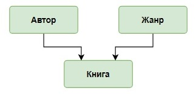
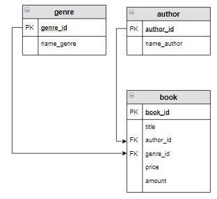
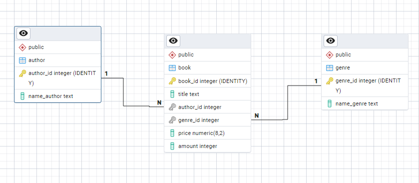
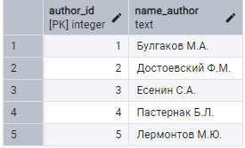
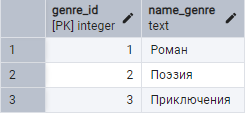
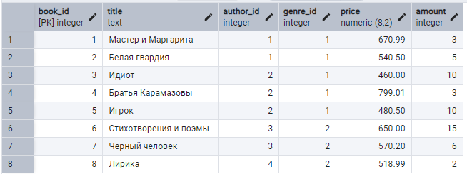
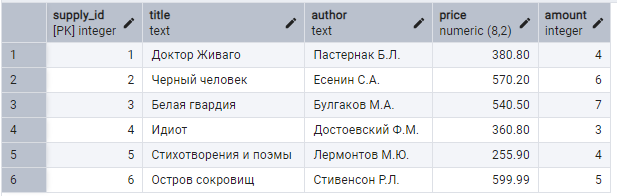

## Структура и наполнение  таблиц
### Концептуальная схема базы данных:



















```sql
DROP TABLE IF EXISTS author CASCADE;
CREATE TABLE IF NOT EXISTS author
(
	author_id   int PRIMARY KEY GENERATED ALWAYS AS IDENTITY,
	name_author text
);

INSERT INTO author(name_author)
VALUES ('Булгаков М.А.'),
       ('Достоевский Ф.М.'),
       ('Есенин С.А.'),
       ('Пастернак Б.Л.'),
       ('Лермонтов М.Ю.');

DROP TABLE IF EXISTS genre CASCADE;
CREATE TABLE IF NOT EXISTS genre
(
	genre_id   INT PRIMARY KEY GENERATED ALWAYS AS IDENTITY,
	name_genre TEXT
);

INSERT INTO genre(name_genre)
VALUES ('Роман'),
       ('Поэзия'),
       ('Приключения');

DROP TABLE IF EXISTS book CASCADE;
CREATE TABLE IF NOT EXISTS book
(
	book_id   INT PRIMARY KEY GENERATED ALWAYS AS IDENTITY,
	title     TEXT,
	author_id INT NOT NULL,
	genre_id  INT,
	price     DECIMAL(8, 2),
	amount    INT,
	FOREIGN KEY (author_id) REFERENCES author (author_id) ON DELETE CASCADE,
	FOREIGN KEY (genre_id) REFERENCES genre (genre_id) ON DELETE SET NULL
);

INSERT INTO book(title, author_id, genre_id, price, amount)
VALUES ('Мастер и Маргарита', 1, 1, 670.99, 3),
       ('Белая гвардия', 1, 1, 540.50, 5),
       ('Идиот', 2, 1, 460.00, 10),
       ('Братья Карамазовы', 2, 1, 799.01, 3),
       ('Игрок', 2, 1, 480.50, 10),
       ('Стихотворения и поэмы', 3, 2, 650.00, 15),
       ('Черный человек', 3, 2, 570.20, 6),
       ('Лирика', 4, 2, 518.99, 2);

DROP TABLE IF EXISTS supply;
CREATE TABLE IF NOT EXISTS supply
(
	supply_id INT PRIMARY KEY GENERATED ALWAYS AS IDENTITY,
	title     TEXT,
	author    TEXT,
	price     DECIMAL(8, 2),
	amount    INT
);

INSERT INTO supply(title, author, price, amount)
VALUES ('Доктор Живаго', 'Пастернак Б.Л.', 380.80, 4),
       ('Черный человек', 'Есенин С.А.', 570.20, 6),
       ('Белая гвардия', 'Булгаков М.А.', 540.50, 7),
       ('Идиот', 'Достоевский Ф.М.', 360.80, 3),
       ('Стихотворения и поэмы', 'Лермонтов М.Ю.', 255.90, 4),
       ('Остров сокровищ', 'Стивенсон Р.Л.', 599.99, 5);

```

## Шаблон

```sql

[ WITH [ RECURSIVE ] with_query [, ...] ]
UPDATE [ ONLY ] table [ [ AS ] alias ]
    SET { column = { expression | DEFAULT } |
          ( column [, ...] ) = ( { expression | DEFAULT } [, ...] ) } [, ...]
    [ FROM from_list ]
    [ WHERE condition | WHERE CURRENT OF cursor_name ]
    [ RETURNING * | output_expression [ [ AS ] output_name ] [, ...] ]
```


## Задача 1

Для книг, которые уже есть на складе (в таблице `book`) по той же цене, что и в поставке (`supply`), увеличить количество на значение, указанное в поставке, а также обнулить количество этих книг в поставке.

### Простое решение (без проверки авторства)

```sql
UPDATE
	book b
SET
	amount = b.amount + s.amount
FROM supply s
WHERE
	b.title = s.title;

```

```sql
UPDATE
	book
SET
	amount = book.amount + s.amount
FROM 
 	supply s, book b
JOIN
	author
ON
	b.author_id = author.author_id 
WHERE
	b.title = s.title;
```


### шаг 1

```sql
SELECT
	author,
	b.title,		
	s.amount as added_amount,
	s.price as supply_price		
FROM
	book as b
JOIN
	author as a ON a.author_id = b.author_id
JOIN 
	supply as s ON b.title = s.title AND s.author = a.name_author
WHERE b.price = s.price	
```


## шаг 2


```sql
WITH join_tables as (
	SELECT
		author,
		b.title,		
		s.amount as added_amount,
		s.price as supply_price		
	FROM
		book as b
	JOIN
		author as a ON a.author_id = b.author_id
	JOIN 
		supply as s ON b.title = s.title AND s.author = a.name_author
	WHERE b.price = s.price	
)
table join_tables;

```


## шаг 3

```sql

WITH join_tables as (
	SELECT
		author,
		b.title,		
		s.amount as added_amount,
		s.price as supply_price		
	FROM
		book as b
	JOIN
		author as a ON a.author_id = b.author_id
	JOIN 
		supply as s ON b.title = s.title AND s.author = a.name_author
	WHERE b.price = s.price	
)
UPDATE
	book 
SET
	amount = book.amount + join_tables.added_amount
FROM join_tables;

```


```sql
UPDATE book
SET
	amount = b.amount + s.amount	
FROM
	book AS b
JOIN
	author as a
ON
	b.author_id = a.author_id
JOIN 
	supply as s
ON b.title = s.title AND a.name_author = s. author AND b.price = s.price;


```


```sql
UPDATE book
     INNER JOIN author ON author.author_id = book.author_id
     INNER JOIN supply ON book.title = supply.title 
                         and supply.author = author.name_author
SET 
    book.price = (book.price * book.amount + supply.price * supply.amount)/(book.amount + supply.amount),
    book.amount = supply.amount  +  book.amount,
    supply.amount = 0

WHERE book.price <> supply.price;

```


## Задача 2

Для книг, которые уже есть на складе (в таблице book), но по другой цене, чем в поставке (supply),  необходимо в таблице book увеличить количество на значение, указанное в поставке,  и пересчитать цену. 

А в таблице  supply обнулить количество этих книг. 

Формула для пересчета цены:


 
где

	p1, p2 - цена книги в таблицах book и supply;
	k1, k2 - количество книг в таблицах book и supply.


Скрипт для одного `update`

```sql
UPDATE
	book b 
SET
	amount = (b.price * b.amount + s.price * s.amount) / (b.amount + s.amount)	
FROM 
 	supply s
WHERE
	b.price <> s.price;

```


Как реализовать 2 `update'a` ?


## Задача 3

В таблице `supply`  есть новые книги, которых на складе еще не было. 

Прежде чем добавлять их в таблицу `book`,  необходимо из таблицы `supply` отобрать новых авторов, если таковые имеются.


Включить новых авторов в таблицу `author` с помощью запроса на добавление.  
Новыми считаются авторы, которые есть в таблице `supply`, но нет в таблице `author`.


```sql
INSERT into author (name_author)
	(
	SELECT supply.author
	FROM 
	    author 
	RIGHT JOIN
		supply
	ON
		author.name_author = supply.author
	WHERE
		name_author IS Null
	);

```


Решение без join'ов


```sql
INSERT INTO
	author (name_author)
SELECT
	author
FROM
	supply
WHERE
	author NOT IN (SELECT name_author FROM author)

```


