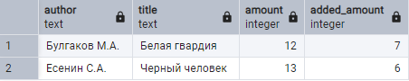
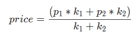
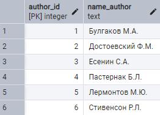
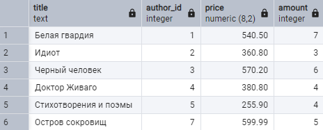
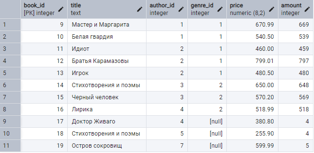

## Шаблон

```sql

[ WITH [ RECURSIVE ] with_query [, ...] ]
UPDATE [ ONLY ] table [ [ AS ] alias ]
    SET { column = { expression | DEFAULT } |
          ( column [, ...] ) = ( { expression | DEFAULT } [, ...] ) } [, ...]
    [ FROM from_list ]
    [ WHERE condition | WHERE CURRENT OF cursor_name ]
    [ RETURNING * | output_expression [ [ AS ] output_name ] [, ...] ]
```


## Задача 1

Для книг, которые уже есть на складе (в таблице `book`) по той же цене, что и в поставке (`supply`), увеличить количество на значение, указанное в поставке, а также обнулить количество этих книг в поставке.

### Простое решение (без проверки авторства)

```sql
UPDATE
	book b
SET
	amount = b.amount + s.amount
FROM supply s
WHERE
	b.title = s.title;

```

```sql
UPDATE
	book
SET
	amount = book.amount + s.amount
FROM 
 	supply s, book b
JOIN
	author
ON
	b.author_id = author.author_id 
WHERE
	b.title = s.title;
```


### шаг 1

```sql
SELECT
	author,
	b.title,		
	s.amount as added_amount,
	s.price as supply_price		
FROM
	book as b
JOIN
	author as a ON a.author_id = b.author_id
JOIN 
	supply as s ON b.title = s.title AND s.author = a.name_author
WHERE b.price = s.price	
```


## шаг 2


```sql
WITH join_tables as (
	SELECT
		author,
		b.title,		
		s.amount as added_amount,
		s.price as supply_price		
	FROM
		book as b
	JOIN
		author as a ON a.author_id = b.author_id
	JOIN 
		supply as s ON b.title = s.title AND s.author = a.name_author
	WHERE b.price = s.price	
)
table join_tables;

```




## шаг 3

```sql

WITH join_tables as (
	SELECT
		author,
		b.title,		
		s.amount as added_amount,
		s.price as supply_price		
	FROM
		book as b
	JOIN
		author as a ON a.author_id = b.author_id
	JOIN 
		supply as s ON b.title = s.title AND s.author = a.name_author
	WHERE b.price = s.price	
)
UPDATE
	book 
SET
	amount = book.amount + join_tables.added_amount
FROM join_tables;

```


```sql
UPDATE book
SET
	amount = b.amount + s.amount	
FROM
	book AS b
JOIN
	author as a
ON
	b.author_id = a.author_id
JOIN 
	supply as s
ON b.title = s.title AND a.name_author = s. author AND b.price = s.price;


```


```sql
UPDATE book
     INNER JOIN author ON author.author_id = book.author_id
     INNER JOIN supply ON book.title = supply.title 
                         and supply.author = author.name_author
SET 
    book.price = (book.price * book.amount + supply.price * supply.amount)/(book.amount + supply.amount),
    book.amount = supply.amount  +  book.amount,
    supply.amount = 0

WHERE book.price <> supply.price;

```


## Задача 2

Для книг, которые уже есть на складе (в таблице `book)`, но по другой цене, чем в поставке (`supply`),  необходимо в таблице `book` увеличить количество на значение, указанное в поставке,  и пересчитать цену. 

А в таблице  supply обнулить количество этих книг. 

Формула для пересчета цены:


 
где

	p1, p2 - цена книги в таблицах book и supply;
	k1, k2 - количество книг в таблицах book и supply.


Скрипт для одного `update`

```sql
UPDATE
	book b 
SET
	amount = (b.price * b.amount + s.price * s.amount) / (b.amount + s.amount)	
FROM 
 	supply s
WHERE
	b.price <> s.price;

```


Как реализовать 2 `update'a` ?


## Задача 3

В таблице `supply`  есть новые книги, которых на складе еще не было. 

Прежде чем добавлять их в таблицу `book`,  необходимо из таблицы `supply` отобрать новых авторов, если таковые имеются.


Включить новых авторов в таблицу `author` с помощью запроса на добавление.  
Новыми считаются авторы, которые есть в таблице `supply`, но нет в таблице `author`.




```sql
INSERT into author (name_author)
	(
	SELECT supply.author
	FROM 
	    author 
	RIGHT JOIN
		supply
	ON
		author.name_author = supply.author
	WHERE
		name_author IS Null
	);

```


Решение без join'ов


```sql
INSERT INTO
	author (name_author)
SELECT
	author
FROM
	supply
WHERE
	author NOT IN (SELECT name_author FROM author)

```


 ## Задача 4. Добавить новые записи о книгах, которые есть в таблице `supply` и нет в таблице `book`. 
 Поскольку в таблице `supply` не указан жанр книги, оставить его пока пустым (занести значение `Null`).

Прежде всего необходимо сформировать запрос с полями, которые соответствуют полям таблицы book, так как использовать только таблицу supply нельзя - в ней вместо кода автора стоит его фамилия. 

Запрос:


 ```sql
SELECT
	title, author_id, price, amount
FROM 
    author 
INNER JOIN
	supply
ON
	author.name_author = supply.author;

 ```


 

 ```sql
SELECT
	title, author_id, price, amount
FROM 
    author a
JOIN
	supply s
ON
	a.name_author = s.author
WHERE
	amount <> 0;

 ```


1 способ

 ```sql
INSERT INTO book (title, author_id, price, amount)
	(
	SELECT	
		title, author_id, price, amount
	FROM 
	    author 
	JOIN
		supply ON author.name_author = supply.author
	WHERE
		amount <> 0
	);

 ```


 2 способ

 ```sql
INSERT INTO
	book (title, author_id, price, amount)
SELECT
	title, author_id, price, amount
FROM
	author
JOIN
	supply
ON
	author.name_author = supply.author
WHERE
	amount <> 0;

 ```


 ```sql
INSERT INTO book (title, author_id, price, amount) 
SELECT 
  title, author_id, price, amount 
FROM 
  supply 
JOIN
  author
ON
	author.name_author = supply.author 
WHERE 
  (title, author_id) NOT IN(
    SELECT 
      title, 
      author_id 
    FROM 
      book
  );



 ```

 ## Задача 5.  Занести для книги «Стихотворения и поэмы» Лермонтова жанр «Поэзия», а для книги «Остров сокровищ» Стивенсона - «Приключения».

```sql
UPDATE book
SET genre_id = 
      (
       SELECT genre_id 
       FROM genre 
       WHERE name_genre = 'Поэзия'
      )
WHERE title = 'Стихотворения и поэмы';

```