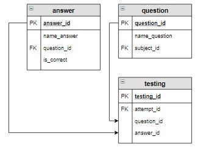

-- Вывести вопросы, которые были включены в тест для Семенова Ивана по дисциплине
-- «Основы SQL» 2020-05-17  (значение attempt_id для этой попытки равно 7).
-- Указать, какой ответ дал студент и правильный он или нет (вывести Верно или Неверно).
-- В результат включить вопрос, ответ и вычисляемый столбец  Результат.


-- Результат

-- +----------------------------------------------------------+-----------------------+-----------+
-- | name_question                                            | name_answer           | Результат |
-- +----------------------------------------------------------+-----------------------+-----------+
-- | Запрос на выборку начинается с ключевого слова:          | INSERT                | Неверно   |
-- | Какой запрос выбирает все записи из таблицы student:     | SELECT * FROM student | Верно     |
-- | Для внутреннего соединения таблиц используется оператор: | CROSS JOIN            | Неверно   |
-- +----------------------------------------------------------+-----------------------+-----------+
--



```sql
CREATE TABLE IF NOT EXISTS answer
(
    answer_id   INT,
    name_answer text,
    question_id INT,
    is_correct  INT
);

INSERT INTO answer
VALUES (1, 'UPDATE', 1, 0),
       (2, 'SELECT', 1, 1),
       (3, 'INSERT', 1, 0),
       (4, 'GROUP BY', 2, 0),
       (5, 'FROM', 2, 0),
       (6, 'WHERE', 2, 1),
       (7, 'SELECT', 2, 0),
       (8, 'SORT', 3, 0),
       (9, 'ORDER BY', 3, 1),
       (10, 'RANG BY', 3, 0),
       (11, 'SELECT * FROM student', 4, 1),
       (12, 'SELECT student', 4, 0),
       (13, 'INNER JOIN', 5, 1),
       (14, 'LEFT JOIN', 5, 0),
       (15, 'RIGHT JOIN', 5, 0),
       (16, 'CROSS JOIN', 5, 0),
       (17, 'совокупность данных, организованныхпо определенным...', 6, 1),
       (18, 'совокупность программ для хранения и обработки ...', 6, 0),
       (19, 'строка', 7, 0),
       (20, 'столбец', 7, 0),
       (21, 'таблица', 7, 1),
       (22, 'обобщенное представление пользователей о данных', 8, 1),
       (23, 'описание представления данных в памяти компьютера', 8, 0),
       (24, 'база данных', 8, 0),
       (25, 'file', 9, 1),
       (26, 'INT', 9, 0),
       (27, 'VARCHAR', 9, 0),
       (28, 'DATE', 9, 0);


CREATE TABLE IF NOT EXISTS testing
(
    testing_id  INT,
    attempt_id  INT,
    question_id INT,
    answer_id   INT
);


INSERT INTO testing 
VALUES (1, 1, 9, 25),
       (2, 1, 7, 19),
       (3, 1, 6, 17),
       (4, 2, 3, 9),
       (5, 2, 1, 2),
       (6, 2, 4, 11),
       (7, 3, 6, 18),
       (8, 3, 8, 24),
       (9, 3, 9, 28),
       (10, 4, 1, 2),
       (11, 4, 5, 16),
       (12, 4, 3, 10),
       (13, 5, 2, 6),
       (14, 5, 1, 2),
       (15, 5, 4, 12),
       (16, 6, 6, 17),
       (17, 6, 8, 22),
       (18, 6, 7, 21),
       (19, 7, 1, 3),
       (20, 7, 4, 11),
       (21, 7, 5, 16);
```


```sql
--solution-1

SELECT q.name_question,
       a.name_answer,
       CASE
           WHEN a.is_correct = 1 THEN 'Верно'
           ELSE 'Неверно'
           END AS "Результат"
FROM testing t
         JOIN question q USING (question_id)
         JOIN answer a USING (answer_id)
WHERE t.attempt_id = 7;

--solution-2


SELECT q.name_question,
       a.name_answer,
       CASE
           WHEN a.is_correct = 1 THEN 'Верно'
           ELSE 'Неверно'
           END AS "Результат"
FROM testing t
         JOIN question q USING (question_id)
         JOIN answer a USING (answer_id)
WHERE t.attempt_id = (SELECT attempt_id
                      FROM attempt
                      WHERE date_attempt = '2020-05-17'
                        AND student_id = (SELECT student_id FROM student WHERE name_student = 'Семенов Иван')
                        AND subject_id = (SELECT subject_id FROM subject WHERE name_subject = 'Основы SQL'));


--solution-3

SELECT question.name_question,
       answer.name_answer,
       CASE
           WHEN answer.is_correct = 1 THEN 'Верно'
           ELSE 'Неверно'
           END AS "Результат"
FROM testing
         INNER JOIN answer USING (answer_id)
         INNER JOIN question ON testing.question_id = question.question_id
         INNER JOIN subject USING (subject_id)
         INNER JOIN attempt USING (attempt_id)
         INNER JOIN student USING (student_id)
WHERE attempt.date_attempt = DATE('2020-05-17')
  AND student.name_student = 'Семенов Иван'
  AND subjec


--solution-4

SELECT name_question,
       name_answer,
       CASE
           WHEN is_correct = 1 THEN 'Верно'
           ELSE 'Неверно'
           END AS "Результат"
FROM question AS q
         INNER JOIN testing AS t ON q.question_id = t.question_id AND t.attempt_id = 7
         INNER JOIN answer AS a USING (answer_id);


--solution-4
SELECT q.name_question,
       a.name_answer,
       CASE a.is_correct
           WHEN 1 THEN 'Верно'
           ELSE 'Неверно'
           END AS "Результат"
FROM question q
         JOIN testing t ON q.question_id = t.question_id
         JOIN answer a ON a.answer_id = t.answer_id
WHERE t.attempt_id = 7;

```


