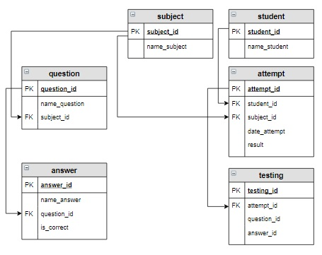

# Задание 
## Для каждого вопроса вывести процент успешных решений, 

* то есть отношение количества верных ответов к общему количеству ответов, 
* значение округлить до 2-х знаков после запятой. 
* Также вывести название предмета, к которому относится вопрос, 
* и общее количество ответов на этот вопрос. 
* В результат включить название дисциплины, вопросы по ней (столбец назвать Вопрос), 
* а также два вычисляемых столбца Всего_ответов и Успешность. 
* Информацию отсортировать сначала по названию дисциплины, потом по убыванию успешности, 
* а потом по тексту вопроса в алфавитном порядке.
* Поскольку тексты вопросов могут быть длинными, обрезать их 30 символов и добавить многоточие "...".


## Результат

+-------------------+-----------------------------------+---------------+------------+
| name_subject      | Вопрос                            | Всего_ответов | Успешность |
+-------------------+-----------------------------------+---------------+------------+
| Основы SQL        | Условие, по которому отбираютс... | 1             | 100.00     |
| Основы SQL        | Запрос на выборку начинается с... | 4             | 75.00      |
| Основы SQL        | Какой запрос выбирает все запи... | 3             | 66.67      |
| Основы SQL        | Для сортировки используется:...   | 2             | 50.00      |
| Основы SQL        | Для внутреннего соединения таб... | 2             | 0.00       |
| Основы баз данных | База данных - это:...             | 3             | 66.67      |
| Основы баз данных | Какой тип данных не допустим в... | 2             | 50.00      |
| Основы баз данных | Концептуальная модель использу... | 2             | 50.00      |
| Основы баз данных | Отношение - это:...               | 2             | 50.00      |
+-------------------+-----------------------------------+---------------+------------+





```sql


--solution-1
SELECT name_subject, name_question, COUNT(question_id) AS Вопрос, ROUND(100 * AVG(is_correct), 2) AS Результат
FROM subject s
         NATURAL JOIN question q
         NATURAL JOIN testing t
         NATURAL JOIN attempt at
         NATURAL JOIN answer an
GROUP BY 1, 2
ORDER BY 1, 4 DESC, 2 DESC;


--solution-2 refactoring

SELECT 
    s.name_subject,
    q.name_question,
    COUNT(DISTINCT t.question_id) AS "Вопрос",
    ROUND(100 * AVG(an.is_correct::numeric), 2) AS "Результат"
FROM 
    subject s
    JOIN question q ON s.subject_id = q.subject_id
    JOIN testing t ON q.question_id = t.question_id
    JOIN attempt at ON t.attempt_id = at.attempt_id
    JOIN answer an ON t.answer_id = an.answer_id
GROUP BY 
    s.name_subject, 
    q.name_question
ORDER BY 
    s.name_subject, 
    "Результат" DESC, 
    q.name_questi


--solution-3 refactoring

SELECT name_subject,
       CONCAT(LEFT(name_question, 30), '...')              AS Вопрос,
       COUNT(is_correct)                                   AS Всего_ответов, 
       ROUND(SUM(is_correct) / COUNT(is_correct) * 100, 2) AS Успешность
FROM testing t INNER JOIN answer a USING (answer_id)
               RIGHT JOIN question q ON q.question_id = a.question_id
               INNER JOIN subject s  ON s.subject_id = q.subject_id
GROUP BY name_subject, name_question 
ORDER BY name_subject, Успешность DESC, name_question;

```


