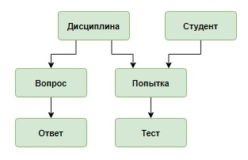

# Предметная область

В университете реализуется on-line тестирование по нескольким дисциплинам. 

* Каждая дисциплина включает некоторое количество вопросов.

* Ответы на вопрос представлены в виде вариантов ответов, один из этих вариантов правильный.

* Студент регистрируется в системе, указав свое имя, фамилию и отчество. 

* После этого он может проходить тестирование по одной или нескольким дисциплинам. 

* Студент имеет несколько попыток для прохождения тестирования  (необходимо сохранять дату попытки). 

* Каждому студенту случайным образом выбирается набор вопросов по дисциплине и формируется индивидуальный тест. 

* Студент отвечает на вопросы, выбирая один из предложенных вариантов ответа.

После окончания тестирования  вычисляется и сохраняется результат (в процентах) попытки.




```sql
DROP TABLE IF EXISTS student CASCADE;

CREATE TABLE IF NOT EXISTS student (
    student_id INT PRIMARY KEY GENERATED ALWAYS AS IDENTITY,
    name_student text
);

DROP TABLE IF EXISTS attempt CASCADE;
CREATE TABLE IF NOT EXISTS attempt (
    attempt_id INT PRIMARY KEY GENERATED ALWAYS AS IDENTITY,
    student_id INT,
    subject_id INT,
    date_attempt DATE,
    RESULT INT
);


INSERT INTO
    student(name_student)
VALUES
    ('Баранов Павел'),
    ('Абрамова Катя'),
    ('Семенов Иван'),
    ('Яковлева Галина');


INSERT INTO
    attempt(student_id, subject_id, date_attempt, result)
VALUES
    (1, 2, '2020-03-23', 67),
    (3, 1, '2020-03-23', 100),
    (4, 2, '2020-03-26', 0),
    (1, 1, '2020-04-15', 33),
    (3, 1, '2020-04-15', 67),
    (4, 2, '2020-04-21', 100),
    (3, 1, '2020-05-17', 33);

-- Вывести студентов (различных студентов), имеющих максимальные результаты попыток.
-- Информацию отсортировать в алфавитном порядке по фамилии студента.--
-- Максимальный результат не обязательно будет 100%,
-- поэтому явно это значение в запросе не задавать.
-- https://stepik.org/lesson/310421/step/4?unit=292727

SELECT
    att.attempt_id,
    att.student_id,
    att.name_student
FROM
    attempt att
WHERE
    att.result = (
        SELECT
            MAX(result)
        FROM
            attempt
    );

-- Решения
--1 with where
SELECT
    st.name_student,
    att.result
FROM
    student st
    JOIN attempt att ON st.student_id = att.student_id
WHERE
    att.result = (
        SELECT
            MAX(result)
        FROM
            attempt
    )
ORDER BY
    1;

--2 without where
SELECT
    name_student,
    result
FROM
    student s
    INNER JOIN attempt a ON s.student_id = a.student_id
    AND result = (
        SELECT
            MAX(result)
        FROM
            attempt
    )
ORDER BY
    1 --3 with distinct and using
SELECT
    DISTINCT name_student,
    result
FROM
    student
    INNER JOIN attempt USING (student_id)
WHERE
    result >= ALL (
        SELECT
            result
        FROM
            attempt
    )
ORDER BY
    name_student;

--4 with HAVING
SELECT
    name_student,
    MAX(result)
FROM
    student
    INNER JOIN attempt USING (student_id)
GROUP BY
    name_student
HAVING
    MAX(result) IN (
        SELECT
            MAX(result)
        FROM
            attempt
    )
ORDER BY
    name_student;

--5 short solution
SELECT
    name_student,
    result
FROM
    student s
    JOIN attempt a ON (
        s.student_id,
        (
            SELECT
                MAX(result)
            FROM
                attempt
        )
    ) = (a.student_id, a.result)
ORDER BY
    name_student;

-- 6
SELECT
    name_student,
    result
FROM
    student
    JOIN attempt USING (student_id)
WHERE
    result >= ALL (
        SELECT
            result
        FROM
            attempt
    )
ORDER BY
    1;
```