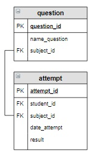

# Задание

Случайным образом выбрать три вопроса (запрос) по дисциплине, тестирование по которой собирается проходить студент,
занесенный в таблицу attempt последним, и добавить их в таблицу testing. 
id последней попытки получить как максимальное значение id из таблицы attempt.



Результат

+------------+------------+-------------+-----------+
| testing_id | attempt_id | question_id | answer_id |
+------------+------------+-------------+-----------+
| 1          | 1          | 9           | 25        |
| 2          | 1          | 7           | 19        |
| 3          | 1          | 6           | 17        |
| 4          | 2          | 3           | 9         |
| 5          | 2          | 1           | 2         |
| 6          | 2          | 4           | 11        |
| 7          | 3          | 6           | 18        |
| 8          | 3          | 8           | 24        |
| 9          | 3          | 9           | 28        |
| 10         | 4          | 1           | 2         |
| 11         | 4          | 5           | 16        |
| 12         | 4          | 3           | 10        |
| 13         | 5          | 2           | 6         |
| 14         | 5          | 1           | 2         |
| 15         | 5          | 4           | 12        |
| 16         | 6          | 6           | 17        |
| 17         | 6          | 8           | 22        |
| 18         | 6          | 7           | 21        |
| 19         | 7          | 1           | 3         |
| 20         | 7          | 4           | 11        |
| 21         | 7          | 5           | 16        |
| 22         | 8          | 6           | NULL      |
| 23         | 8          | 8           | NULL      |
| 24         | 8          | 7           | NULL      |
+------------+------------+-------------+-----------+


```sql

--solution-1

INSERT INTO testing (attempt_id, question_id)
SELECT attempt_id, question_id
FROM question
         NATURAL JOIN attempt
WHERE attempt_id = (SELECT MAX(attempt_id) FROM attempt)
ORDER BY RANDOM()
LIMIT 3;

--solution-2

INSERT INTO testing (attempt_id, question_id)
SELECT attempt_id, question_id
FROM question
         JOIN attempt USING (subject_id)
ORDER BY attempt_id DESC, rand()
LIMIT 3;


--solution-3-with-cte

WITH vars AS (SELECT MAX(attempt_id) AS max_attempt_id
              FROM attempt),
     subject AS (SELECT subject_id
                 FROM attempt
                 WHERE attempt_id = (SELECT max_attempt_id FROM vars))

INSERT
INTO testing (attempt_id, question_id)
SELECT (SELECT max_attempt_id FROM vars),
       question_id
FROM question
WHERE subject_id = (SELECT subject_id FROM subject)
ORDER BY RANDOM()
LIMIT 3;


--etc


WITH max_id AS (SELECT MAX(attempt_id) FROM attempt)
SELECT *
FROM max_id;


WITH max_id AS (SELECT MAX(attempt_id) FROM attempt)

INSERT
INTO testing (attempt_id, question_id)
SELECT attempt_id, question_id
FROM question
         NATURAL JOIN attempt
WHERE attempt_id = (SELECT * FROM max_id)
ORDER BY RANDOM()
LIMIT 3;

```


