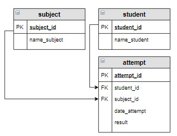

# Задание

В таблицу attempt включить новую попытку для студента Баранова Павла по дисциплине «Основы баз данных».
Установить текущую дату в качестве даты выполнения попытки.



Результат

+------------+------------+------------+--------------+--------+
| attempt_id | student_id | subject_id | date_attempt | result |
+------------+------------+------------+--------------+--------+
| 1          | 1          | 2          | 2020-03-23   | 67     |
| 2          | 3          | 1          | 2020-03-23   | 100    |
| 3          | 4          | 2          | 2020-03-26   | 0      |
| 4          | 1          | 1          | 2020-04-15   | 33     |
| 5          | 3          | 1          | 2020-04-15   | 67     |
| 6          | 4          | 2          | 2020-04-21   | 100    |
| 7          | 3          | 1          | 2020-05-17   | 33     |
| 8          | 1          | 2          | 2020-06-12   | NULL   |
+------------+------------+------------+--------------+--------+


```sql
INSERT INTO attempt (student_id, subject_id, date_attempt)
VALUES ((SELECT student_id FROM student WHERE name_student = 'Баранов Павел'),
        (SELECT subject_id FROM subject WHERE name_subject = 'Основы баз данных'),
        NOW());

```


