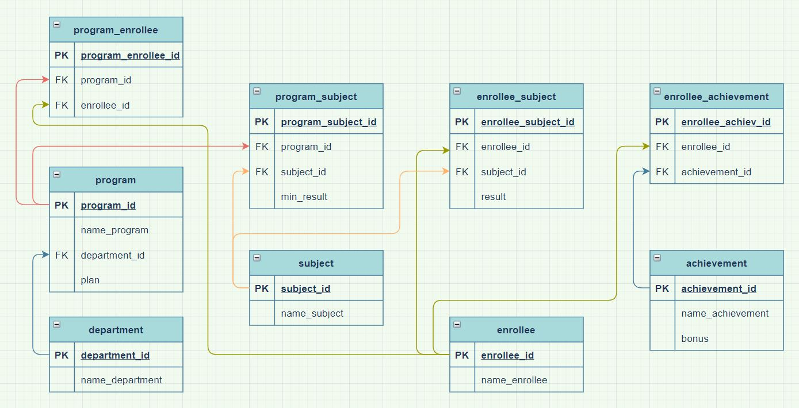
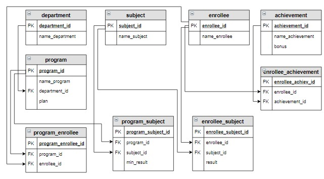

# Исходные данные 


Предметная область
Университет состоит из совокупности факультетов (школ).

Поступление абитуриентов осуществляется на образовательные программы по результатам Единого государственного экзамена (ЕГЭ). 

Каждая образовательная программа относится к определенному факультету, для нее определены необходимые для поступления предметы ЕГЭ,
минимальный балл по этим предметам, а также план набора (количество мест) на образовательную программу.

В приемную комиссию абитуриенты подают заявления на образовательную программу, каждый абитуриент может выбрать
несколько образовательных программ (но не более трех). В заявлении указывается фамилия, имя, отчество абитуриента, 
а также его достижения: получил ли он медаль за обучение в школе, имеет ли значок ГТО и пр. 

При этом за каждое достижение определен дополнительный балл. Абитуриент предоставляет сертификат с результатами сдачи  ЕГЭ. 

Если абитуриент выбирает образовательную программу, то у него обязательно должны быть сданы предметы, определенные на эту 
программу, причем балл должен быть не меньше минимального по данному предмету.

Зачисление абитуриентов осуществляется так: сначала вычисляется сумма баллов по предметам на каждую образовательную программу, добавляются баллы достижения, затем абитуриенты сортируются в порядке убывания суммы баллов и отбираются первые по количеству мест, определенному планом набора.







```sql

CREATE TABLE department
(
    department_id   SERIAL PRIMARY KEY,
    name_department VARCHAR(30)
);
INSERT INTO department (department_id, name_department)
VALUES (1, 'Инженерная школа'),
       (2, 'Школа естественных наук');

CREATE TABLE subject
(
    subject_id   SERIAL PRIMARY KEY,
    name_subject VARCHAR(30)
);
INSERT INTO subject (name_subject)
VALUES ('Русский язык'),
       ('Математика'),
       ('Физика'),
       ('Информатика');

CREATE TABLE program
(
    program_id    SERIAL PRIMARY KEY,
    name_program  VARCHAR(50),
    department_id INT,
    plan          INT,
    FOREIGN KEY (department_id) REFERENCES department (department_id) ON DELETE CASCADE
);

INSERT INTO program (name_program, department_id, plan)
VALUES ('Прикладная математика и информатика', 2, 2),
       ('Математика и компьютерные науки', 2, 1),
       ('Прикладная механика', 1, 2),
       ('Мехатроника и робототехника', 1, 3);

CREATE TABLE enrollee
(
    enrollee_id   SERIAL PRIMARY KEY,
    name_enrollee VARCHAR(50)
);

CREATE TABLE achievement
(
    achievement_id   SERIAL PRIMARY KEY,
    name_achievement VARCHAR(30),
    bonus            INT
);

CREATE TABLE enrollee_achievement
(
    enrollee_achiev_id SERIAL PRIMARY KEY,
    enrollee_id        INT,
    achievement_id     INT,
    FOREIGN KEY (enrollee_id) REFERENCES enrollee (enrollee_id) ON DELETE CASCADE,
    FOREIGN KEY (achievement_id) REFERENCES achievement (achievement_id) ON DELETE CASCADE
);

CREATE TABLE program_subject
(
    program_subject_id SERIAL PRIMARY KEY,
    program_id         INT,
    subject_id         INT,
    min_result         INT,
    FOREIGN KEY (program_id) REFERENCES program (program_id) ON DELETE CASCADE,
    FOREIGN KEY (subject_id) REFERENCES subject (subject_id) ON DELETE CASCADE
);


CREATE TABLE program_enrollee
(
    program_enrollee_id SERIAl PRIMARY KEY,
    program_id          INT,
    enrollee_id         INT,
    FOREIGN KEY (program_id) REFERENCES program (program_id) ON DELETE CASCADE,
    FOREIGN KEY (enrollee_id) REFERENCES enrollee (enrollee_id) ON DELETE CASCADE
);

CREATE TABLE enrollee_subject
(
    enrollee_subject_id SERIAL PRIMARY KEY,
    enrollee_id         INT,
    subject_id          INT,
    result              INT,
    FOREIGN KEY (enrollee_id) REFERENCES enrollee (enrollee_id) ON DELETE CASCADE,
    FOREIGN KEY (subject_id) REFERENCES subject (subject_id) ON DELETE CASCADE
);


INSERT INTO enrollee (name_enrollee)
VALUES ('Баранов Павел'),
       ('Абрамова Катя'),
       ('Семенов Иван'),
       ('Яковлева Галина'),
       ('Попов Илья'),
       ('Степанова Дарья');


INSERT INTO achievement (name_achievement, bonus)
VALUES ('Золотая медаль', 5),
       ('Серебряная медаль', 3),
       ('Золотой значок ГТО', 3),
       ('Серебряный значок ГТО', 1);


INSERT INTO enrollee_achievement (enrollee_id, achievement_id)
VALUES (1, 2),
       (1, 3),
       (3, 1),
       (4, 4),
       (5, 1),
       (5, 3);


INSERT INTO program_subject (program_id, subject_id, min_result)
VALUES (1, 1, 40),
       (1, 2, 50),
       (1, 4, 60),
       (2, 1, 30),
       (2, 2, 50),
       (2, 4, 60),
       (3, 1, 30),
       (3, 2, 45),
       (3, 3, 45),
       (4, 1, 40),
       (4, 2, 45),
       (4, 3, 45);


INSERT INTO program_enrollee (program_id, enrollee_id)
VALUES (3, 1),
       (4, 1),
       (1, 1),
       (2, 2),
       (1, 2),
       (1, 3),
       (2, 3),
       (4, 3),
       (3, 4),
       (3, 5),
       (4, 5),
       (2, 6),
       (3, 6),
       (4, 6);


INSERT INTO enrollee_subject (enrollee_id, subject_id, result)
VALUES (1, 1, 68),
       (1, 2, 70),
       (1, 3, 41),
       (1, 4, 75),
       (2, 1, 75),
       (2, 2, 70),
       (2, 4, 81),
       (3, 1, 85),
       (3, 2, 67),
       (3, 3, 90),
       (3, 4, 78),
       (4, 1, 82),
       (4, 2, 86),
       (4, 3, 70),
       (5, 1, 65),
       (5, 2, 67),
       (5, 3, 60),
       (6, 1, 90),
       (6, 2, 92),
       (6, 3, 88),
       (6, 4, 94);

```

Результат
Affected rows: 6

Query result:
+------------+------------+------------+--------------+--------+
| attempt_id | student_id | subject_id | date_attempt | result |
+------------+------------+------------+--------------+--------+
| 7          | 3          | 1          | 2020-05-17   | 33     |
| 8          | 1          | 2          | 2020-06-12   | 67     |
+------------+------------+------------+--------------+--------+
Affected rows: 2

Query result:
+------------+------------+-------------+-----------+
| testing_id | attempt_id | question_id | answer_id |
+------------+------------+-------------+-----------+
| 19         | 7          | 1           | 3         |
| 20         | 7          | 4           | 11        |
| 21         | 7          | 5           | 16        |
| 22         | 8          | 7           | 19        |
| 23         | 8          | 6           | 17        |
| 24         | 8          | 8           | 22        |
+------------+------------+-------------+-----------+

------+-------------+-----------+


```sql

--solution-1

DELETE
FROM attempt
WHERE date_attempt < '2020-05-01';

--solution-2-without-cascading

DELETE
FROM attempt a
    USING testing t
WHERE a.attempt_id = t.attempt_id
  AND a.date_attempt < '2020-05-01';


```


