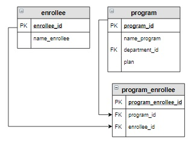

# Задание
Вывести абитуриентов, которые хотят поступать на образовательную программу 
«Мехатроника и робототехника» в отсортированном по фамилиям виде.




Результат
+-----------------+
| name_enrollee   |
+-----------------+
| Баранов Павел   |
| Попов Илья      |
| Семенов Иван    |
| Степанова Дарья |
+-----------------+


```sql

--solution-1

SELECT name_enrollee
FROM enrollee e
         NATURAL JOIN program_enrollee pe
         NATURAL JOIN program p
WHERE p.name_program = 'Мехатроника и робототехника'
ORDER BY 1;


--solution-2
SELECT name_enrollee
FROM enrollee
WHERE enrollee_id IN (SELECT enrollee_id
                      FROM program_enrollee
                      WHERE program_id = (SELECT program_id
                                          FROM program
                                          WHERE name_program = 'Мехатроника и робототехника'))
ORDER BY name_enrollee


--solution-3

SELECT name_enrollee
FROM enrollee
         JOIN program_enrollee USING (enrollee_id)
WHERE program_id = (SELECT program_id FROM program WHERE name_program = 'Мехатроника и робототехника')
ORDER BY 1


```


