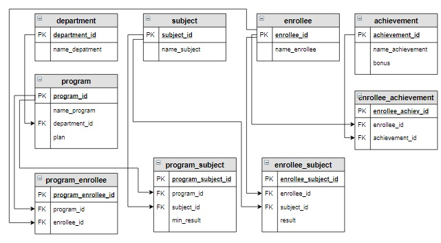

# Задание

Вывести название образовательной программы и фамилию тех абитуриентов, которые подавали документы на эту образовательную программу,
но не могут быть зачислены на нее. Эти абитуриенты имеют результат по одному или нескольким предметам ЕГЭ, 
необходимым для поступления на эту образовательную программу, меньше минимального балла.
Информацию вывести в отсортированном сначала по программам, а потом по фамилиям абитуриентов виде.

Например, Баранов Павел по «Физике» набрал 41 балл, а для образовательной программы «Прикладная механика» 
минимальный балл по этому предмету определен в 45 баллов. 
Следовательно, абитуриент на данную программу не может поступить.



Для этого задания в базу данных добавлена строка:

```sql
INSERT INTO enrollee_subject (enrollee_id, subject_id, result) VALUES (2, 3, 41);
```


Результат

| name_program                | name_enrollee |
|-----------------------------|---------------|
| Мехатроника и робототехника | Баранов Павел |


```sql
--preparation

SELECT name_program, name_enrollee, min_result, result, ps.program_id, pe.program_id
FROM program
         NATURAL JOIN program_subject ps
         NATURAL JOIN enrollee
         NATURAL JOIN enrollee_subject
         NATURAL JOIN program_enrollee pe
WHERE result < min_result;


--solution-1


SELECT name_program, name_enrollee
FROM program
         NATURAL JOIN program_subject
         NATURAL JOIN enrollee
         NATURAL JOIN enrollee_subject
         NATURAL JOIN program_enrollee
WHERE result < min_result;

--solution-2
SELECT name_program,
       name_enrollee
FROM program
         NATURAL JOIN program_subject
         NATURAL JOIN program_enrollee
         NATURAL JOIN enrollee
         JOIN enrollee_subject
              USING (enrollee_id, subject_id)
WHERE result < min_result
ORDER BY 1, 2;


```


