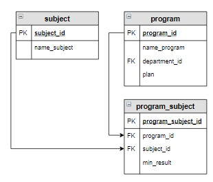

# Задание


Вывести образовательные программы, на которые для поступления необходим предмет «Информатика». 
Программы отсортировать в обратном алфавитном порядке.





Результат

+-------------------------------------+
| name_program                        |
+-------------------------------------+
| Прикладная математика и информатика |
| Математика и компьютерные науки     |
+-------------------------------------+


```sql

--solution-1

SELECT name_program
FROM subject
         NATURAL JOIN program_subject
         NATURAL JOIN program
WHERE name_subject = 'Информатика';


--solution-2
SELECT name_program
FROM program
         NATURAL JOIN program_subject
         NATURAL JOIN subject
WHERE name_subject = 'Информатика';


--solution-3


SELECT name_program
FROM program p
         NATURAL JOIN program_subject p_s
         JOIN subject s ON s.subject_id = p_s.subject_id AND name_subject = 'Информатика';


```


