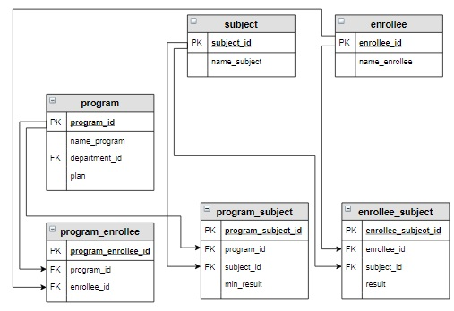

# Задание

Поскольку при добавлении дополнительных баллов, абитуриенты по каждой образовательной программе могут
следовать не в порядке убывания суммарных баллов, необходимо создать новую таблицу applicant_order на основе таблицы applicant. 

При создании таблицы данные нужно отсортировать сначала по id образовательной программы,
потом по убыванию итогового балла. 

А таблицу applicant, которая была создана как вспомогательная, необходимо удалить.




Результат


| program_id | enrollee_id | itog |
|------------|-------------|------|
| 1          | 3           | 235  |
| 1          | 2           | 226  |
| 1          | 1           | 219  |
| 2          | 6           | 276  |
| 2          | 3           | 235  |
| 2          | 2           | 226  |
| 3          | 6           | 270  |
| 3          | 4           | 239  |
| 3          | 5           | 200  |
| 4          | 6           | 270  |
| 4          | 3           | 247  |
| 4          | 5           | 200  |


```sql
--solution-1


CREATE TABLE applicant_order AS
SELECT *
FROM applicant
ORDER BY 1, 3 DESC;


```


