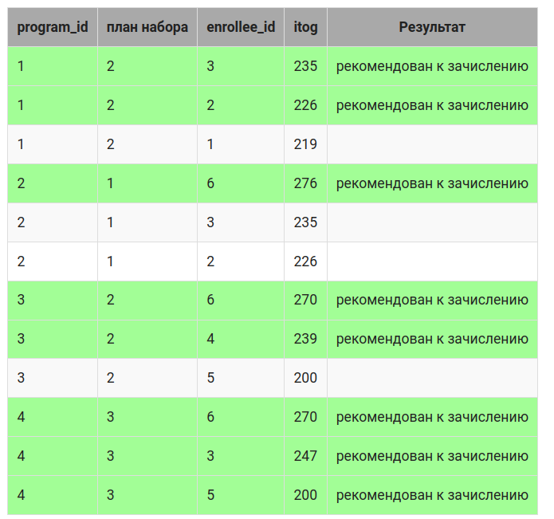

# Задание


## Зачисление студентов

Рассмотрим, как происходит формирование списка абитуриентов, проходящих по конкурсу на образовательные программы. 

В таблицу applicant_order для пояснения включены столбцы «План набора» и «Результат».

Каждая программа имеет свой план набора, например, план набора образовательной программы с id 1 – 2 человека. 

Проходящими по конкурсу считаются первые два человека в списке  отсортированных по итоговому баллу абитуриентов,
подавших заявление на  образовательную программу. 

Это абитуриенты с id 3 и 2. Аналогично отбираются абитуриенты на остальные образовательные программы. 

В таблице все проходящие по конкурсу выделены зеленым цветом.





# Задание

Включить в таблицу applicant_order новый столбец str_id целого типа , расположить его перед первым.


Результат


| program_id | enrollee_id | itog |
|------------|-------------|------|
| 1          | 3           | 235  |
| 1          | 2           | 226  |
| 1          | 1           | 219  |
| 2          | 6           | 276  |
| 2          | 3           | 235  |
| 2          | 2           | 226  |
| 3          | 6           | 270  |
| 3          | 4           | 239  |
| 3          | 5           | 200  |
| 4          | 6           | 270  |
| 4          | 3           | 247  |
| 4          | 5           | 200  |


```sql
--solution-1

ALTER TABLE applicant_order 
ADD COLUMN str_id int;


--solution-2

```


