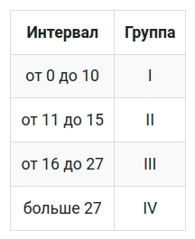

# Пример

Отнести каждого студента к группе, в зависимости от пройденных заданий:



1) Выведем всех студентов и все шаги, которые они прошли с результатом "correct".
   Этот шаг обязателен, чтобы не учитывать правильные решения несколько раз.

```sql
SELECT student_name, step_id
FROM student
         NATURAL JOIN step_student
WHERE result = 'correct'
GROUP BY student_name, step_id;

```

Результат

| student_name | step_id |
|--------------|---------|
| student_52   | 10      |
| student_11   | 10      |
| student_19   | 10      |
| student_4    | 10      |
| student_5    | 10      |
| student_53   | 10      |
| student_39   | 10      |
| student_32   | 10      |
| student_61   | 10      |
| student_43   | 10      |
| student_13   | 10      |
| student_57   | 10      |

             ...

2) Посчитаем, сколько шагов прошел каждый студент

Результат:

| student_name | rate |
|--------------|------|
| student_29   | 8    |
| student_47   | 8    |
| student_16   | 9    |
| student_5    | 9    |
| student_63   | 9    |
| student_33   | 10   |
| student_17   | 10   |
| student_64   | 10   |

            ...

```sql

SELECT student_name, COUNT(step_id)
FROM student
         NATURAL JOIN step_student
WHERE result = 'correct'
GROUP BY student_name
ORDER BY 2;

```

или

```sql
SELECT student_name, COUNT(*) AS rate
FROM (SELECT student_name, step_id
      FROM student
               NATURAL JOIN step_student
      WHERE result = 'correct'
      GROUP BY student_name, step_id) query_in
GROUP BY student_name
ORDER BY 2;
```

3) Отнести каждого студента к группе в зависимости от пройденных шагов.

```sql

--простое решение 

SELECT student_name,
       COUNT(step_id) AS rate,
       CASE
           WHEN COUNT(step_id) <= 10 THEN 'I'
           WHEN COUNT(step_id) <= 15 THEN 'II'
           WHEN COUNT(step_id) <= 27 THEN 'III'
           ELSE 'IV'
           END        AS Группа
FROM student
         NATURAL JOIN step_student
WHERE result = 'correct'
GROUP BY student_name
ORDER BY 2;


-- корректное решение
SELECT student_name,
       rate,
       CASE
           WHEN rate <= 10 THEN 'I'
           WHEN rate <= 15 THEN 'II'
           WHEN rate <= 27 THEN 'III'
           ELSE 'IV'
           END AS Группа
FROM (SELECT student_name, COUNT(*) AS rate
      FROM (SELECT student_name, step_id
            FROM student
                     NATURAL JOIN step_student
            WHERE result = 'correct'
            GROUP BY student_name, step_id) query_in
      GROUP BY student_name
      ORDER BY 2) query_in_1;

--или

WITH student_progress AS (SELECT student_name,
                                 COUNT(step_id) AS solved_count
                          FROM student
                                   NATURAL JOIN step_student
                          WHERE result = 'correct'
                          GROUP BY student_name),
     group_classification AS (SELECT student_name,
                                     solved_count AS rate,
                                     CASE
                                         WHEN solved_count <= 10 THEN 'I'
                                         WHEN solved_count <= 15 THEN 'II'
                                         WHEN solved_count <= 27 THEN 'III'
                                         ELSE 'IV'
                                         END      AS group_level
                              FROM student_progress)
SELECT student_name,
       rate,
       group_level
FROM group_classification
ORDER BY rate;

```

| student_name | rate | Группа |
|--------------|------|--------|
| student_29   | 8    | I      |
| student_47   | 8    | I      |
| student_16   | 9    | I      |
| student_5    | 9    | I      |
| student_63   | 9    | I      |
| student_33   | 10   | I      |
| student_17   | 10   | I      |
| student_64   | 10   | I      |
| student_58   | 10   | I      |
| student_38   | 10   | I      |
| student_12   | 11   | II     |
| student_10   | 11   | II     |

              ...


# Задание

Посчитать, сколько студентов относится к каждой группе. 
Столбцы назвать Группа, Интервал, Количество. 
Указать границы интервала.


| Группа | Интервал    | Количество |
|--------|-------------|------------|
| I      | от 0 до 10  | 10         |
| II     | от 11 до 15 | 27         |
| III    | от 16 до 27 | 9          |
| IV     | больше 27   | 18         |


```sql

--solution-1


SELECT CASE
          WHEN rate <= 10 THEN 'I'
          WHEN rate <= 15 THEN 'II'
          WHEN rate <= 27 THEN 'III'
          ELSE 'IV'
          END            AS Группа,
       CASE
          WHEN rate <= 10 THEN 'от 0 до 10'
          WHEN rate <= 15 THEN 'от 11 до 15'
          WHEN rate <= 27 THEN 'от 16 до 27'
          ELSE 'больше 27'
          END            AS Интервал,
       COUNT(student_id) AS Количество
FROM (SELECT student_id, COUNT(result) AS rate
      FROM step_student
      WHERE result = 'correct'
      GROUP BY student_id) query_in
GROUP BY 1, 2
ORDER BY 1;


--solution-2

SELECT Группа,
       CASE
          WHEN Группа = 'I' THEN 'от 0 до 10'
          WHEN Группа = 'II' THEN 'от 11 до 15'
          WHEN Группа = 'III' THEN 'от 16 до 27'
          ELSE 'больше 27' END AS Интервал,
       COUNT(*)                AS Количество
FROM (SELECT CASE
                WHEN rate <= 10 THEN 'I'
                WHEN rate <= 15 THEN 'II'
                WHEN rate <= 27 THEN 'III'
                ELSE 'IV'
                END AS Группа
      FROM (SELECT student_name, COUNT(*) AS rate
            FROM student
                    NATURAL JOIN step_student
            WHERE result = 'correct'
            GROUP BY 1) query1) query2
GROUP BY 1
ORDER BY 1;


--solution-2  С использованием врем. таблицы

CREATE TEMPORARY TABLE temp_student_rates AS
SELECT student_name,
       rate,
       CASE
          WHEN rate <= 10 THEN 'I'
          WHEN rate <= 15 THEN 'II'
          WHEN rate <= 27 THEN 'III'
          ELSE 'IV'
          END AS Группа
FROM (SELECT student_name, COUNT(*) AS rate
      FROM (SELECT student_name, step_id
            FROM student
                    INNER JOIN step_student USING (student_id)
            WHERE result = 'correct'
            GROUP BY student_name, step_id) query_in
      GROUP BY student_name
      ORDER BY 2) query_in_1;


-- == Основной запрос с ипользованием врем.таблицы temp_student_rates ==     
SELECT Группа,
       CASE Группа
          WHEN 'I' THEN 'от 0 до 10'
          WHEN 'II' THEN 'от 11 до 15'
          WHEN 'III' THEN 'от 16 до 27'
          ELSE 'больше 27'
          END   AS Интервал,
       COUNT(*) AS Количество
FROM temp_student_rates
GROUP BY 1; -- Группа; 
```


