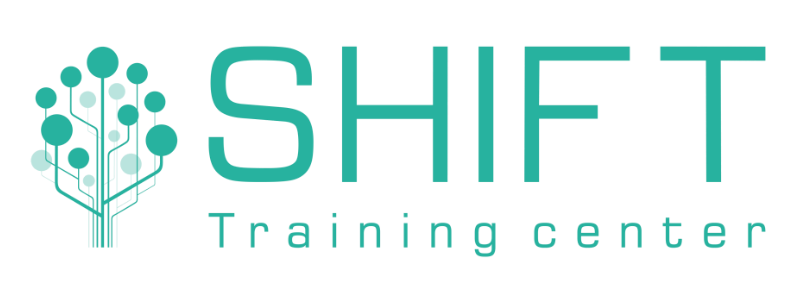

# ПРОГРАММА ОБУЧЕНИЯ
## по курсу «Анализ данных на языке SQL»

## Длительность обучения: 24 ак. часа/3 дня

# Содержание:

## День 1.

## Модуль 1. Реляционные базы данных:

* Введение. Основы теории баз данных 
* Общее устройство PostgreSQL;. 
* Консольный клиент. Управление сервером
* Графический клиент pgAdmin;
* Запросы SQL в pgAdmin
* Настройка параметров конфигурации
* Клиент-серверный протокол
* Набор требований ACID
* Язык запросов SQL;

## Модуль 2. Определение структуры данных
* Создание и удаление базы данных
* Создание и удаление таблиц
* Типы данных в PostgreSQL
* Ограничения столбцов и таблиц
* Внешние ключи
* Изменение таблиц
* Извлечение данных из различных источников. Импорт-экспорт данных (txt, csv, stdin) 

## Модуль 3. Операции с данными
* Добавление данных. Команда Insert
* Получение данных. Команда Select
* Фильтрация. WHERE
* Обновление данных. Команда UPDATE
* Удаление данных. Команда DELETE

## День 2.

## Модуль 4. Запросы

* DISTINCT. Выборка уникальных значений
* ORDER BY. Сортировка
* Получение диапазона строк. LIMIT и OFFSET
* Операторы фильтрации
* Агрегатные функции
* Группировка
* Подзапросы

## Модуль  5. Составные типы данных

* Массивы
* Перечисления enum

## Модуль  6. Соединение таблиц

* Неявное соединение таблиц
* INNER JOIN
* OUTER JOIN и CROSS JOIN
* Группировка в соединениях
* Объединение множеств. UNION
* Разность множеств. EXCEPT
* Пересечение множеств. INTERSECT

## День 3.

## Модуль  7. PL/pgSQL

* Обзор и конструкции языка
* Функции  
* Составные типы    
* Выполнение запросов  
* Курсоры  
* Динамические команды  
* Массивы  
* Обработка ошибок 

## Модуль  8

