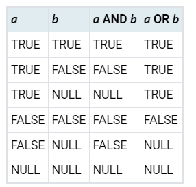

# Логические операторы и условные выражения


## Логические операторы 

Набор логических операторов включает обычные:

```
boolean AND boolean → boolean
boolean OR boolean → boolean
NOT boolean → boolean
```

В `SQL`работает логическая система с тремя состояниями: `true (истина), false (ложь) и NULL`, «неопределённое» состояние. 

Рассмотрим следующую таблицу истинности:



```sql
SELECT 
	5 > 2,
	5 >= 2,
	5 = 5,
	5 != 5,
	5 <> 5,
	2 BETWEEN 1 AND 3,
	2 NOT BETWEEN 1 AND 3,
    2 >= 1 and 2 <= 3,
	2 BETWEEN SYMMETRIC 3 AND 1,
	1.5 IS NULL,
	1 IS DISTINCT FROM NULL,
	NULL::boolean IS TRUE,
	NULL::boolean IS UNKNOWN ;
```


Предикат `BETWEEN` упрощает проверки интервала:

`a BETWEEN x AND y` 

равнозначно

`a >= x AND a <= y`

`BETWEEN` считает, что границы интервала включаются в интервал. 


Для значений не `NULL` условие `IS DISTINCT FROM` работает так же, как оператор <>. 

Однако если оба сравниваемых значения `NULL`, результат будет `false`, и только если одно из значений `NULL`, возвращается true.

Аналогично, условие `IS NOT DISTINCT FROM` равносильно = для значений не NULL, но возвращает true, если оба сравниваемых значения `NULL`, и `false` в противном случае.

Таким образом, эти предикаты по сути работают с `NULL`, как с обычным значением, а не с «неопределённостью».

* CASE
* COALESCE
* NULLIF
* GREATEST и LEAST

## CASE 

Выражение `CASE` в `SQL` представляет собой общее условное выражение, напоминающее операторы `if/else` в других языках программирования:


```sql
CREATE TABLE test(a integer);
insert INTO test (a) values (1),(2),(3);

```


```sql
SELECT a,
    CASE WHEN a=1 THEN 'one'
        WHEN a=2 THEN 'two'
        ELSE 'other'
    END
FROM test;
```


```sql
SELECT a,
    CASE a WHEN 1 THEN 'one'
        WHEN 2 THEN 'two'
        ELSE 'other'
    END
FROM test;
```


```sql
SELECT a,
    CASE a WHEN 1 THEN 'one'
        WHEN 2 THEN 'two'
        ELSE 'other'
    END
FROM test;
```